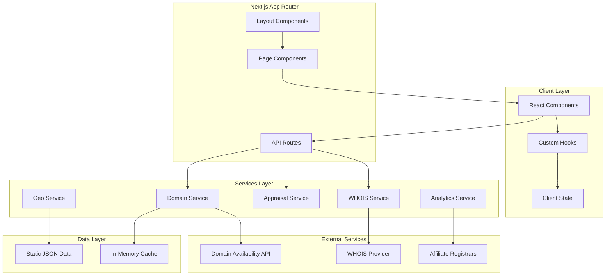

# Design Document: DomainsDiscovery.com

## Overview

DomainsDiscovery.com is a comprehensive domain discovery platform built with Next.js 14 App Router, TypeScript, and Tailwind CSS. The architecture follows a modular, component-based design with clear separation between presentation, business logic, and data layers. The platform prioritizes SEO, performance, and user experience with a modern dark-mode aesthetic.

The system is designed as a client-heavy application with lightweight API routes that proxy to external domain services. This approach minimizes server costs while maximizing client-side interactivity and responsiveness.

## Architecture



### High-Level Architecture Decisions

1. **Next.js 14 App Router**: Leverages React Server Components for optimal SEO and initial page load performance
2. **API Routes as Proxies**: Thin API layer that proxies requests to external services, handling rate limiting and caching
3. **Static Data Files**: Geographic and TLD data stored as JSON files for fast access without database overhead
4. **Client-Side State**: React hooks manage UI state; no global state management library needed for this scope
5. **Edge Caching**: Vercel Edge caching for API responses to minimize external API calls

## Components and Interfaces

### Directory Structure

```
src/
├── app/
│   ├── (marketing)/
│   │   ├── page.tsx                 # Homepage
│   │   ├── about/page.tsx
│   │   ├── contact/page.tsx
│   │   ├── privacy/page.tsx
│   │   └── terms/page.tsx
│   ├── (tools)/
│   │   ├── generator/page.tsx
│   │   ├── geo/page.tsx
│   │   ├── bulk/page.tsx
│   │   ├── whois/
│   │   │   ├── page.tsx
│   │   │   └── [domain]/page.tsx
│   │   ├── appraisal/page.tsx
│   │   └── expired/page.tsx
│   ├── tld/[tld]/page.tsx
│   ├── blog/
│   │   ├── page.tsx
│   │   └── [slug]/page.tsx
│   ├── api/
│   │   ├── check/route.ts
│   │   ├── bulk/route.ts
│   │   ├── whois/route.ts
│   │   ├── suggest/route.ts
│   │   └── appraise/route.ts
│   ├── layout.tsx
│   ├── globals.css
│   └── sitemap.ts
├── components/
│   ├── layout/
│   │   ├── Navigation.tsx
│   │   ├── Footer.tsx
│   │   ├── MobileMenu.tsx
│   │   └── Breadcrumbs.tsx
│   ├── ui/
│   │   ├── Button.tsx
│   │   ├── Input.tsx
│   │   ├── Card.tsx
│   │   ├── Badge.tsx
│   │   ├── Modal.tsx
│   │   ├── Tooltip.tsx
│   │   ├── Skeleton.tsx
│   │   ├── Toast.tsx
│   │   └── GlowEffect.tsx
│   ├── domain/
│   │   ├── SearchBar.tsx
│   │   ├── DomainCard.tsx
│   │   ├── DomainGrid.tsx
│   │   ├── TLDSelector.tsx
│   │   ├── AvailabilityBadge.tsx
│   │   └── RegisterButton.tsx
│   ├── generator/
│   │   ├── KeywordInput.tsx
│   │   ├── GeneratorFilters.tsx
│   │   └── SuggestionList.tsx
│   ├── geo/
│   │   ├── LocationSelector.tsx
│   │   ├── GeoResults.tsx
│   │   └── PopulationBadge.tsx
│   ├── home/
│   │   ├── HeroSection.tsx
│   │   ├── FeaturesSection.tsx
│   │   ├── StatsSection.tsx
│   │   ├── TestimonialsSection.tsx
│   │   ├── FAQSection.tsx
│   │   └── CTASection.tsx
│   └── seo/
│       ├── JsonLd.tsx
│       ├── MetaTags.tsx
│       └── CanonicalUrl.tsx
├── hooks/
│   ├── useDomainSearch.ts
│   ├── useDomainGenerator.ts
│   ├── useBulkChecker.ts
│   ├── useWHOIS.ts
│   ├── useAppraisal.ts
│   └── useAnalytics.ts
├── services/
│   ├── domainService.ts
│   ├── whoisService.ts
│   ├── appraisalService.ts
│   ├── geoService.ts
│   └── analyticsService.ts
├── lib/
│   ├── utils.ts
│   ├── validators.ts
│   ├── rateLimiter.ts
│   └── cache.ts
├── data/
│   ├── countries.json
│   ├── cities.json
│   ├── keywords.json
│   ├── tlds.json
│   └── registrars.json
└── types/
    ├── domain.ts
    ├── whois.ts
    ├── geo.ts
    └── api.ts
```

### Core Component Interfaces

```typescript
// types/domain.ts
interface DomainCheckResult {
  domain: string;
  available: boolean;
  tld: string;
  checkedAt: Date;
  registrarLinks?: RegistrarLink[];
}

interface RegistrarLink {
  name: string;
  url: string;
  price?: string;
  affiliate: boolean;
}

interface DomainSuggestion {
  domain: string;
  score: number;
  available?: boolean;
  source: 'keyword' | 'ai' | 'geo';
}

// types/whois.ts
interface WHOISResult {
  domain: string;
  registrar: string;
  registrant?: RegistrantInfo;
  dates: {
    created: Date;
    updated: Date;
    expires: Date;
  };
  nameServers: string[];
  dnssec: boolean;
  rawData: string;
}

interface RegistrantInfo {
  name?: string;
  organization?: string;
  country?: string;
  email?: string;
}

// types/geo.ts
interface GeoLocation {
  name: string;
  type: 'country' | 'city';
  population: number;
  countryCode?: string;
}

interface GeoDomainResult {
  domain: string;
  location: GeoLocation;
  available?: boolean;
}

// types/api.ts
interface APIResponse<T> {
  success: boolean;
  data?: T;
  error?: APIError;
  meta?: {
    timestamp: number;
    cached: boolean;
  };
}

interface APIError {
  code: string;
  message: string;
  details?: Record<string, unknown>;
}
```

### Service Layer Interfaces

```typescript
// services/domainService.ts
interface DomainService {
  checkAvailability(domain: string): Promise<DomainCheckResult>;
  checkBulk(domains: string[]): Promise<DomainCheckResult[]>;
  generateSuggestions(keyword: string, options: GeneratorOptions): DomainSuggestion[];
  getRegistrarLinks(domain: string): RegistrarLink[];
}

interface GeneratorOptions {
  tlds: string[];
  position: 'start' | 'end' | 'both';
  maxLength: number;
  excludeNumbers: boolean;
  excludeHyphens: boolean;
}

// services/whoisService.ts
interface WHOISService {
  lookup(domain: string): Promise<WHOISResult>;
  parseRawWHOIS(raw: string): WHOISResult;
}

// services/appraisalService.ts
interface AppraisalService {
  appraise(domain: string): Promise<AppraisalResult>;
}

interface AppraisalResult {
  domain: string;
  estimatedValue: {
    low: number;
    mid: number;
    high: number;
  };
  confidence: number;
  factors: AppraisalFactor[];
}

interface AppraisalFactor {
  name: string;
  impact: 'positive' | 'negative' | 'neutral';
  weight: number;
  description: string;
}

// services/geoService.ts
interface GeoService {
  getCountries(): GeoLocation[];
  getCities(countryCode?: string): GeoLocation[];
  generateGeoDomains(keyword: string, locations: GeoLocation[], tlds: string[]): GeoDomainResult[];
}
```

### Hook Interfaces

```typescript
// hooks/useDomainSearch.ts
interface UseDomainSearchReturn {
  results: DomainCheckResult[];
  isLoading: boolean;
  error: Error | null;
  search: (query: string, tlds: string[]) => Promise<void>;
  clearResults: () => void;
}

// hooks/useBulkChecker.ts
interface UseBulkCheckerReturn {
  results: DomainCheckResult[];
  progress: number;
  isChecking: boolean;
  error: Error | null;
  checkDomains: (domains: string[]) => Promise<void>;
  exportCSV: () => void;
  cancel: () => void;
}

// hooks/useAnalytics.ts
interface UseAnalyticsReturn {
  trackSearch: (query: string, results: number) => void;
  trackToolUsage: (tool: string) => void;
  trackAffiliateClick: (registrar: string, domain: string) => void;
  trackExport: (type: string, count: number) => void;
}
```

## Data Models

### Static Data Schemas

```typescript
// data/tlds.json schema
interface TLDData {
  tld: string;           // e.g., "com", "io", "ai"
  name: string;          // e.g., "Commercial"
  type: 'gTLD' | 'ccTLD' | 'newTLD';
  registry: string;
  introduced: number;    // year
  restrictions?: string;
  popularity: number;    // 1-100 score
  avgPrice: number;      // USD
}

// data/countries.json schema
interface CountryData {
  name: string;
  code: string;          // ISO 3166-1 alpha-2
  population: number;
  continent: string;
}

// data/cities.json schema
interface CityData {
  name: string;
  country: string;       // country code
  population: number;
  region?: string;
}

// data/keywords.json schema
interface KeywordData {
  word: string;
  category: string;      // e.g., "tech", "business", "creative"
  popularity: number;    // 1-100 score
}

// data/registrars.json schema
interface RegistrarData {
  name: string;
  slug: string;
  baseUrl: string;
  affiliateParam: string;
  affiliateId: string;
  supportedTLDs: string[];
  pricing: Record<string, number>;
}
```

### API Request/Response Schemas

```typescript
// GET /api/check?domain=example.com
interface CheckRequest {
  domain: string;
}

interface CheckResponse extends APIResponse<DomainCheckResult> {}

// POST /api/bulk
interface BulkRequest {
  domains: string[];     // max 500
}

interface BulkResponse extends APIResponse<{
  results: DomainCheckResult[];
  processed: number;
  failed: number;
}> {}

// GET /api/whois?domain=example.com
interface WHOISRequest {
  domain: string;
}

interface WHOISResponse extends APIResponse<WHOISResult> {}

// GET /api/suggest?keyword=tech&tlds=com,io&count=20
interface SuggestRequest {
  keyword: string;
  tlds?: string[];
  count?: number;
  position?: 'start' | 'end' | 'both';
}

interface SuggestResponse extends APIResponse<DomainSuggestion[]> {}

// GET /api/appraise?domain=example.com
interface AppraiseRequest {
  domain: string;
}

interface AppraiseResponse extends APIResponse<AppraisalResult> {}
```

### SEO Data Models

```typescript
// JSON-LD Schemas
interface WebApplicationSchema {
  '@context': 'https://schema.org';
  '@type': 'WebApplication';
  name: string;
  url: string;
  description: string;
  applicationCategory: string;
  operatingSystem: string;
  offers: {
    '@type': 'Offer';
    price: string;
    priceCurrency: string;
  };
}

interface FAQPageSchema {
  '@context': 'https://schema.org';
  '@type': 'FAQPage';
  mainEntity: Array<{
    '@type': 'Question';
    name: string;
    acceptedAnswer: {
      '@type': 'Answer';
      text: string;
    };
  }>;
}

interface BreadcrumbSchema {
  '@context': 'https://schema.org';
  '@type': 'BreadcrumbList';
  itemListElement: Array<{
    '@type': 'ListItem';
    position: number;
    name: string;
    item: string;
  }>;
}

// Page Meta Data
interface PageMeta {
  title: string;
  description: string;
  keywords: string[];
  canonical: string;
  openGraph: {
    title: string;
    description: string;
    image: string;
    type: string;
  };
  twitter: {
    card: string;
    title: string;
    description: string;
    image: string;
  };
}
```

### Validation Schemas

```typescript
// Domain validation
interface DomainValidation {
  isValid: boolean;
  normalized: string;
  errors: string[];
}

function validateDomain(input: string): DomainValidation {
  // Validates domain format, length, allowed characters
  // Returns normalized lowercase domain
}

// Bulk input validation
interface BulkValidation {
  valid: string[];
  invalid: Array<{ input: string; reason: string }>;
  duplicates: string[];
}

function validateBulkInput(input: string | File): Promise<BulkValidation> {
  // Parses textarea or file input
  // Validates each domain
  // Removes duplicates
  // Enforces 500 domain limit
}
```


## Correctness Properties

*A property is a characteristic or behavior that should hold true across all valid executions of a system—essentially, a formal statement about what the system should do. Properties serve as the bridge between human-readable specifications and machine-verifiable correctness guarantees.*

### Property 1: TLD Selection Coverage

*For any* domain search query and any set of selected TLDs, the search results SHALL contain exactly one result per selected TLD, with each result containing the queried domain name combined with the corresponding TLD.

**Validates: Requirements 1.2**

### Property 2: Availability Display Consistency

*For any* domain check result, the rendered output SHALL display a visual indicator that correctly reflects the availability status—green/available indicator for available domains and red/taken indicator for unavailable domains.

**Validates: Requirements 1.3**

### Property 3: Registrar Links for Available Domains

*For any* domain that is marked as available, the system SHALL include at least one registrar link in the result, and all registrar links SHALL contain valid URLs with the domain name.

**Validates: Requirements 1.4**

### Property 4: Generator Keyword Position Placement

*For any* keyword and position option (start/end/both), all generated domain suggestions SHALL have the keyword placed according to the selected position—at the start of the domain name for "start", at the end for "end", or either position for "both".

**Validates: Requirements 2.2**

### Property 5: Generator Max Length Enforcement

*For any* max length setting N, all generated domain suggestions (excluding TLD) SHALL have a length less than or equal to N characters.

**Validates: Requirements 2.3**

### Property 6: Generator Character Exclusion

*For any* filter configuration with excluded characters (numbers, hyphens), all generated domain suggestions SHALL NOT contain any of the excluded character types.

**Validates: Requirements 2.4**

### Property 7: CSV Export Round Trip

*For any* set of domain results (from generator, geo, or bulk checker), exporting to CSV and then parsing the CSV SHALL produce a data set equivalent to the original results, preserving all domain names, availability statuses, and associated metadata.

**Validates: Requirements 2.6, 3.4, 4.7**

### Property 8: Geo Domain Population Sorting

*For any* set of geo domain results, the results SHALL be sorted in descending order by population, such that for any two consecutive results, the first result's location population is greater than or equal to the second result's location population.

**Validates: Requirements 3.2**

### Property 9: Bulk Input Parsing

*For any* textarea input containing domain names separated by newlines, the parser SHALL extract exactly the non-empty, trimmed lines as individual domain candidates, and for any valid domain format, it SHALL be included in the parsed output.

**Validates: Requirements 4.1**

### Property 10: Bulk Domain Limit Enforcement

*For any* input containing 500 or fewer valid domains, the bulk checker SHALL process all domains. *For any* input containing more than 500 domains, the bulk checker SHALL reject the request with an appropriate error.

**Validates: Requirements 4.5, 4.6**

### Property 11: WHOIS Display Completeness

*For any* WHOIS result that contains data, the rendered display SHALL include the registrar name, creation date, expiration date, and name servers fields.

**Validates: Requirements 5.2**

### Property 12: Shareable URL Generation

*For any* WHOIS lookup result, the generated shareable URL SHALL contain the domain name and SHALL resolve to a page displaying the same WHOIS information.

**Validates: Requirements 5.4**

### Property 13: Appraisal Result Completeness

*For any* domain appraisal result, the display SHALL include a value range (low, mid, high), a confidence score between 0 and 100, and at least one contributing factor with name and impact.

**Validates: Requirements 6.3**

### Property 14: Expired Domain Display Completeness

*For any* expired domain result, the display SHALL include the expiration date, domain age (in years or days), and an estimated value.

**Validates: Requirements 7.2**

### Property 15: Expired Domain Filter Application

*For any* filter configuration (TLD, length, keywords), all displayed expired domain results SHALL match the filter criteria—correct TLD, length within bounds, and containing specified keywords.

**Validates: Requirements 7.3**

### Property 16: TLD Page Completeness

*For any* TLD in the supported TLD data set, a page SHALL exist at /tld/[tld], and that page SHALL display the TLD's registry information, pricing data, and include valid JSON-LD structured data.

**Validates: Requirements 8.1, 8.2, 8.4**

### Property 17: Blog Post SEO Completeness

*For any* blog post page, the HTML SHALL include a title meta tag, description meta tag, Open Graph tags (og:title, og:description, og:image), Twitter Card tags, and valid JSON-LD Article structured data.

**Validates: Requirements 9.3**

### Property 18: API Response Structure Consistency

*For any* API endpoint response (success or error), the response body SHALL conform to the APIResponse schema with a boolean `success` field, and either a `data` field (on success) or an `error` field with `code` and `message` (on failure).

**Validates: Requirements 11.6**

### Property 19: Page SEO Completeness

*For any* public page in the application, the HTML SHALL include a title tag, meta description, canonical URL, Open Graph tags, and Twitter Card tags.

**Validates: Requirements 13.1, 13.2, 13.3**

### Property 20: Sitemap URL Coverage

*For any* public page route in the application, the generated sitemap.xml SHALL contain a corresponding URL entry with the correct loc, and the sitemap SHALL be valid XML conforming to the sitemap protocol.

**Validates: Requirements 13.4**

### Property 21: JSON-LD Schema Validity

*For any* page that includes JSON-LD structured data, the JSON-LD SHALL be valid JSON, SHALL include a valid @context and @type, and SHALL conform to the schema.org specification for the declared type.

**Validates: Requirements 13.6**

### Property 22: Rate Limiter Enforcement

*For any* sequence of API requests from the same client exceeding the configured rate limit within the time window, requests beyond the limit SHALL receive a 429 status code response with a Retry-After header.

**Validates: Requirements 14.1, 14.7**

### Property 23: Input Sanitization

*For any* user input string, the sanitized output SHALL NOT contain script tags, event handlers, or other potentially dangerous HTML/JavaScript constructs, while preserving the semantic content of valid domain-related input.

**Validates: Requirements 14.2**

### Property 24: CSP Header Presence

*For any* HTTP response from the application, the response headers SHALL include a Content-Security-Policy header with appropriate directives.

**Validates: Requirements 14.6**

### Property 25: Analytics Event Recording

*For any* trackable user action (search, tool usage, affiliate click, export, page view), the analytics tracker SHALL record an event with the action type, timestamp, and relevant metadata.

**Validates: Requirements 15.1, 15.2, 15.3, 15.4, 15.5**

## Error Handling

### Client-Side Errors

| Error Type | Handling Strategy | User Feedback |
|------------|-------------------|---------------|
| Invalid domain format | Validate before submission | Inline error message with format hint |
| Empty search query | Prevent submission | Placeholder text guidance |
| Network timeout | Retry with exponential backoff | "Connection slow, retrying..." toast |
| API error response | Display error message | Contextual error with retry option |
| File upload failure | Validate file type/size | "Invalid file format" message |
| Bulk limit exceeded | Prevent submission | "Maximum 500 domains" warning |

### API Error Responses

```typescript
// Standard error codes
enum APIErrorCode {
  INVALID_INPUT = 'INVALID_INPUT',
  RATE_LIMITED = 'RATE_LIMITED',
  EXTERNAL_SERVICE_ERROR = 'EXTERNAL_SERVICE_ERROR',
  NOT_FOUND = 'NOT_FOUND',
  INTERNAL_ERROR = 'INTERNAL_ERROR',
}

// Error response structure
interface ErrorResponse {
  success: false;
  error: {
    code: APIErrorCode;
    message: string;
    details?: Record<string, unknown>;
  };
}

// HTTP status code mapping
const statusCodeMap: Record<APIErrorCode, number> = {
  INVALID_INPUT: 400,
  RATE_LIMITED: 429,
  EXTERNAL_SERVICE_ERROR: 502,
  NOT_FOUND: 404,
  INTERNAL_ERROR: 500,
};
```

### External Service Failures

1. **Domain Availability API Failure**
   - Return cached result if available (< 5 minutes old)
   - Display "Unable to verify availability" status
   - Log error for monitoring

2. **WHOIS Provider Failure**
   - Display partial data if available
   - Show "Some information unavailable" notice
   - Offer retry option

3. **Rate Limit from External API**
   - Queue request for delayed retry
   - Display estimated wait time to user
   - Implement request prioritization

### Graceful Degradation

```typescript
// Fallback chain for domain checking
async function checkDomainWithFallback(domain: string): Promise<DomainCheckResult> {
  try {
    // Primary: Real-time API check
    return await primaryDomainAPI.check(domain);
  } catch (primaryError) {
    try {
      // Fallback: Secondary provider
      return await secondaryDomainAPI.check(domain);
    } catch (secondaryError) {
      // Final fallback: Return unknown status
      return {
        domain,
        available: null, // Unknown
        tld: extractTLD(domain),
        checkedAt: new Date(),
        error: 'Unable to verify availability',
      };
    }
  }
}
```

## Testing Strategy

### Testing Framework Stack

- **Unit Testing**: Jest with React Testing Library
- **Property-Based Testing**: fast-check
- **E2E Testing**: Playwright
- **API Testing**: Supertest

### Unit Testing Approach

Unit tests focus on specific examples, edge cases, and error conditions:

```typescript
// Example: Domain validation unit tests
describe('validateDomain', () => {
  it('should accept valid domain formats', () => {
    expect(validateDomain('example.com').isValid).toBe(true);
    expect(validateDomain('sub.example.co.uk').isValid).toBe(true);
  });

  it('should reject invalid domain formats', () => {
    expect(validateDomain('').isValid).toBe(false);
    expect(validateDomain('invalid').isValid).toBe(false);
    expect(validateDomain('-invalid.com').isValid).toBe(false);
  });

  it('should normalize domains to lowercase', () => {
    expect(validateDomain('EXAMPLE.COM').normalized).toBe('example.com');
  });
});
```

### Property-Based Testing Configuration

Property-based tests verify universal properties across randomized inputs:

```typescript
import * as fc from 'fast-check';

// Configuration: Minimum 100 iterations per property
const propertyConfig = { numRuns: 100 };

// Example: Property test for generator max length
// Feature: domains-discovery-platform, Property 5: Generator Max Length Enforcement
describe('Domain Generator Properties', () => {
  it('should never exceed max length', () => {
    fc.assert(
      fc.property(
        fc.string({ minLength: 1, maxLength: 20 }),  // keyword
        fc.integer({ min: 5, max: 63 }),              // maxLength
        (keyword, maxLength) => {
          const suggestions = generateDomainSuggestions(keyword, { maxLength });
          return suggestions.every(s => s.domain.split('.')[0].length <= maxLength);
        }
      ),
      propertyConfig
    );
  });
});
```

### Property Test Implementation Requirements

Each correctness property from the design document MUST be implemented as a single property-based test:

1. **Property 1: TLD Selection Coverage** - Test that search returns exactly one result per selected TLD
2. **Property 4: Generator Keyword Position** - Test keyword placement for all position options
3. **Property 5: Generator Max Length** - Test length constraint enforcement
4. **Property 6: Generator Character Exclusion** - Test filter application
5. **Property 7: CSV Export Round Trip** - Test export/import preserves data
6. **Property 8: Geo Population Sorting** - Test descending sort order
7. **Property 9: Bulk Input Parsing** - Test newline parsing accuracy
8. **Property 10: Bulk Limit Enforcement** - Test 500 domain limit
9. **Property 18: API Response Structure** - Test response schema conformance
10. **Property 22: Rate Limiter** - Test rate limit enforcement
11. **Property 23: Input Sanitization** - Test dangerous input removal

### Test Tagging Convention

All property tests MUST include a comment tag referencing the design property:

```typescript
// Feature: domains-discovery-platform, Property 5: Generator Max Length Enforcement
// Validates: Requirements 2.3
```

### E2E Testing Strategy

Playwright tests for critical user flows:

1. **Homepage Search Flow**: Enter domain → View results → Click registrar
2. **Generator Flow**: Enter keyword → Apply filters → Check all → Export
3. **Bulk Checker Flow**: Upload file → View progress → Filter results → Export
4. **WHOIS Flow**: Enter domain → View results → Copy/Share

### Test Coverage Targets

| Category | Target Coverage |
|----------|-----------------|
| Unit Tests | 80% line coverage |
| Property Tests | All 25 correctness properties |
| E2E Tests | All critical user flows |
| API Tests | All endpoints with success/error cases |

### Continuous Integration

```yaml
# Test pipeline stages
stages:
  - lint: ESLint + Prettier
  - typecheck: TypeScript compilation
  - unit: Jest unit tests
  - property: fast-check property tests (100+ iterations each)
  - e2e: Playwright browser tests
  - lighthouse: Performance/SEO/Accessibility audits
```
