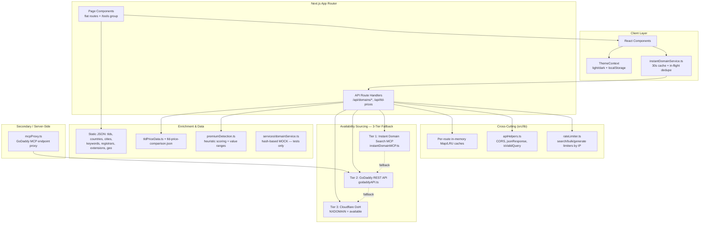

# Design Document: DomainsDiscovery.com

## Overview

DomainsDiscovery.com is a domain discovery platform built with Next.js 14 App Router, TypeScript, and Tailwind CSS. The architecture follows a modular, component-based design with clear separation between presentation (React components/pages), an API route layer (Next.js Route Handlers), integration libraries (`src/lib`), and static JSON data.

Domain availability is **not** backed by a single "Domain Availability API". The production availability path is a **three-tier fallback chain** that combines the Instant Domain Search MCP server, the GoDaddy REST API, and DNS-over-HTTPS (DoH) via Cloudflare. DNS resolution is the universal fallback: a DNS `Status` of `3` (NXDOMAIN) is treated as "available". A legacy hash-based mock still exists in `src/services/domainService.ts` for unit/property tests, but it is **not** on the production request path.

This document has been reconciled against the actual implemented codebase. Where the originally-planned design drifted from what was built, the discrepancy is called out explicitly in **Implementation Reconciliation Notes** below rather than hidden.

### Implementation Reconciliation Notes

These are known points where the requirements/original design and the implemented code disagree. They are documented here so the drift is explicit and can be resolved deliberately.

1. **`<50ms` availability response time (Requirement 1.1) is aspirational, not a real end-to-end guarantee.**
   The production availability path makes live network calls — MCP (700–1200ms timeouts), GoDaddy REST, and/or Cloudflare DoH (700–2000ms timeouts). None of these can guarantee `<50ms`. The only way a response is served in tens of milliseconds is a **cache hit**:
   - Server-side per-route in-memory caches (e.g. `instant-check` LRU: 5-min TTL, max 10k entries; `search` DNS cache: 10-min TTL; `premium-check`: 10-min TTL).
   - Client-side caches in `instantDomainService.ts` (30s search cache + in-flight request de-duplication).
   The `<50ms` figure should be treated as a **client-perceived target for repeat/cached lookups** and as marketing copy on the homepage stats — not a verifiable system property. This should be reworded in the requirements or downgraded to a non-binding goal.

2. **Theme system contradicts the "dark mode" mandate (Requirement 16.1).**
   `src/contexts/ThemeContext.tsx` implements a **light/dark theme toggle** persisted to `localStorage` (default `dark`, toggles a `light` class on `documentElement`). Requirement 16.1 mandates a dark-only palette. The code supports both themes, so the requirement and implementation conflict. This needs an explicit product decision: either (a) update Requirement 16.1 to allow a light/dark toggle, or (b) remove/disable the light theme. The design does **not** silently pick one — it flags the conflict for resolution.

3. **`whois`, `value`, and `prices` domain endpoints are referenced by the client but not implemented.**
   `src/services/instantDomainService.ts` calls `GET /api/domains/whois`, `GET /api/domains/value`, and `GET /api/domains/prices`. No route handlers exist for these paths (the only handlers under `src/app/api/domains/` are `check`, `generate`, `instant-check`, `premium-check`, `search`). These client functions will currently fail/return `null`. They are documented below as **planned / not-yet-implemented**. WHOIS (Requirement 5) and Appraisal (Requirement 6) therefore do not have a working backend yet; the appraisal/value heuristics that DO exist live in `src/lib/premiumDetection.ts` and are not yet wired to an endpoint.

4. **Mock vs. real availability — two code paths exist.**
   `src/services/domainService.ts#getMockAvailability` returns deterministic hash-based availability and is used by the legacy service and its tests. The authoritative production path is the API routes (`/api/domains/*`), which use MCP → GoDaddy → DNS. When reading this design, treat the **API routes as authoritative** and the `domainService.ts` mock as test scaffolding only.

5. **Caching is in-memory per route, not Vercel Edge cache.**
   The original design implied Vercel Edge caching. In reality each route module holds its own in-memory `Map`/LRU cache, and `apiHelpers.jsonResponse` additionally sets `Cache-Control: public, s-maxage=…, stale-while-revalidate=…` headers (which a CDN *may* honor). The in-memory caches are per-instance and do not survive serverless cold starts or span multiple instances.

## Architecture



### High-Level Architecture Decisions

1. **Next.js 14 App Router**: React Server Components for SEO and initial load; client components for interactive tools. Routes are **flat** (e.g. `/search`, `/generator`, `/bulk-search`) with a `/tools/*` group for utility tools — not the `(marketing)`/`(tools)` route groups originally proposed.
2. **API Route Handlers as orchestrators (not thin proxies)**: Each `/api/domains/*` handler implements real orchestration logic — input validation, rate limiting, multi-source sourcing, batching/concurrency control, caching, and premium enrichment. They are heavier than the originally-planned "thin proxy".
3. **Three-tier availability sourcing**: MCP first (premium/marketplace-aware), GoDaddy second (authoritative pricing/premium), Cloudflare DoH last (universal, free, NXDOMAIN-based). Tiers are feature-flagged (`ENABLE_MCP_SEARCH`, `ENABLE_PREMIUM_ENRICHMENT`).
4. **Static JSON data**: Geographic, TLD, keyword, registrar, and extension data stored as JSON files under `src/data` for fast access without a database.
5. **In-memory caching + Cache-Control headers**: Each route holds its own TTL-based `Map`/LRU cache; `apiHelpers.jsonResponse` also emits CDN-friendly `Cache-Control` headers. (See Reconciliation Note 5 — this is not Vercel Edge cache.)
6. **Per-concern rate limiting keyed by client IP**: separate sliding-window limiters for search (30/min), bulk (5/min), and generation (10/min), with `429` + `Retry-After` and `X-RateLimit-*` headers.
7. **Light/dark theme via context**: `ThemeContext` persists theme to `localStorage`. (See Reconciliation Note 2 — conflicts with dark-only Requirement 16.1.)

## Components and Interfaces

### Directory Structure (actual)

```
src/
├── app/
│   ├── page.tsx                     # Homepage
│   ├── layout.tsx
│   ├── globals.css
│   ├── error.tsx
│   ├── not-found.tsx
│   ├── sitemap.ts
│   ├── opengraph-image.tsx
│   ├── twitter-image.tsx
│   ├── enhanced-page.tsx
│   ├── search/page.tsx              # Instant domain search
│   ├── generator/page.tsx           # Keyword generator
│   ├── bulk-search/page.tsx         # Bulk availability checker
│   ├── expired/page.tsx             # Expired domains finder
│   ├── premium/page.tsx             # Premium domains
│   ├── saved-domains/page.tsx       # Saved domains
│   ├── domain-extensions/page.tsx   # TLD/extension info
│   ├── blog/page.tsx
│   ├── learn/
│   │   ├── page.tsx
│   │   └── [slug]/                  # Dynamic learn articles
│   ├── faq/page.tsx
│   ├── contact/page.tsx
│   ├── privacy/page.tsx
│   ├── terms/page.tsx
│   ├── tools/
│   │   ├── whois/page.tsx           # WHOIS tool UI (backend not yet implemented)
│   │   ├── value/page.tsx           # Value/appraisal tool UI (backend not yet implemented)
│   │   ├── keyword/page.tsx
│   │   ├── geo/page.tsx
│   │   ├── brandable/page.tsx
│   │   └── compare/page.tsx
│   └── api/
│       ├── domains/
│       │   ├── search/route.ts          # POST — MCP + DNS + premium enrichment
│       │   ├── instant-check/route.ts   # POST/GET — MCP-first + DNS, LRU cache
│       │   ├── check/route.ts           # POST/GET — pure DNS batch checker
│       │   ├── generate/route.ts        # POST — MCP variations + fallback generator
│       │   └── premium-check/route.ts   # POST — GoDaddy + MCP enrichment
│       └── tld-prices/route.ts          # GET — TLD price dataset
├── components/
│   ├── domain/      # search bar, domain cards/grid, availability badges, etc.
│   ├── generator/   # keyword input, filters, suggestion list
│   ├── geo/         # location selector, geo results, population badges
│   ├── home/        # hero, features, stats, FAQ, CTA sections
│   ├── layout/      # navigation, footer, mobile menu, breadcrumbs
│   ├── sections/    # reusable page sections
│   ├── seo/         # JSON-LD, meta tags, canonical URL helpers
│   └── ui/          # buttons, inputs, cards, badges, modals, etc.
├── contexts/
│   └── ThemeContext.tsx             # light/dark theme (localStorage)
├── services/
│   ├── domainService.ts             # LEGACY hash-based mock (tests only)
│   └── instantDomainService.ts      # client API wrapper (calls /api/domains/*)
├── lib/
│   ├── apiHelpers.ts                # CORS, jsonResponse/errorResponse, isValidQuery
│   ├── rateLimiter.ts               # per-concern sliding-window limiters
│   ├── instantDomainMCP.ts          # Tier 1: Instant Domain Search MCP client
│   ├── godaddyAPI.ts                # Tier 2: GoDaddy REST API client
│   ├── mcpProxy.ts                  # secondary GoDaddy MCP endpoint proxy
│   ├── premiumDetection.ts          # heuristic premium scoring + value ranges
│   ├── tldPriceData.ts              # TLD price dataset accessors
│   ├── registrars.ts                # registrar helpers
│   ├── cache.ts                     # cache utilities
│   ├── utils.ts
│   └── validators.ts
└── data/
    ├── tlds.json
    ├── countries.json
    ├── cities.json
    ├── cities-expanded.json
    ├── keywords.json
    ├── registrars.json
    ├── extensions.json
    ├── tld-price-comparison.json
    ├── us-states.json
    ├── canada-provinces.json
    └── australia-states.json
```

### Core Component / Result Types

These reflect the shapes actually returned by the API routes and integration libraries.

```typescript
// Availability result shape returned by /api/domains/search
interface SearchResult {
  domain: string;        // e.g. "example.com"
  available: boolean;
  tld: string;           // e.g. "com" (no leading dot)
  price: string;         // hardcoded getPriceForTLD() table, e.g. "$12.99"
  premium: boolean;
}

// Result shape returned by /api/domains/instant-check
interface InstantCheckResult {
  domain: string;
  available: boolean;
  premium?: boolean;
  price?: string;        // marketplace price if premium
  buyUrl?: string;       // GoDaddy listing URL for premium/marketplace domains
  purchaseInfo?: string; // e.g. "View listing on GoDaddy"
}

// Result shape returned by /api/domains/check (pure DNS)
interface DnsCheckResult {
  domain: string;
  available: boolean;    // true when Cloudflare DoH Status === 3 (NXDOMAIN)
}

// Result shape returned by /api/domains/generate
interface DomainVariation {
  domain: string;
  available: boolean;
  score: number;         // relevance/quality score
  reason: string;        // human-readable rationale
}

// Result shape returned by /api/domains/premium-check
interface PremiumCheckResult {
  domain: string;
  available: boolean;
  premium: boolean;
  price?: string;
  source: 'godaddy' | 'mcp' | 'cache' | 'fallback';
}

// Internal result from instantDomainMCP.ts
interface MCPDomainCheckResult {
  domain: string;
  available: boolean;
  premium?: boolean;
  price?: string;        // market price ÷ 100 (cents → dollars)
  buyUrl?: string;
  purchaseInfo?: string;
}

// Internal result from godaddyAPI.ts
interface GoDaddyResult {
  domain: string;
  available: boolean;
  premium?: boolean;     // heuristic: priceInDollars > 20
  price?: number;        // micro-units ÷ 1,000,000
}
```

### Service Layer Interfaces

```typescript
// services/instantDomainService.ts — CLIENT-side wrapper around /api/domains/*
// Includes a 30s search cache and in-flight request de-duplication.
export function searchDomains(
  query: string,
  tlds?: string[],
  options?: { signal?: AbortSignal }
): Promise<SearchResult[]>;                                   // → POST /api/domains/search

export function generateDomainVariations(
  keyword: string, count?: number
): Promise<DomainVariation[]>;                                // → POST /api/domains/generate

export function checkDomainAvailability(
  domains: string[]
): Promise<InstantCheckResult[]>;                             // → POST /api/domains/instant-check

// ⚠ Planned / NOT-YET-IMPLEMENTED — no backend route handlers exist (see Reconciliation Note 3)
export function getWhoisInfo(domain: string): Promise<unknown | null>;        // → GET /api/domains/whois
export function getDomainValue(domain: string): Promise<unknown | null>;      // → GET /api/domains/value
export function getPriceComparison(domain: string): Promise<unknown | null>;  // → GET /api/domains/prices

// services/domainService.ts — LEGACY mock service (used by unit/property tests only)
export function checkAvailability(domain: string): Promise<DomainCheckResult>; // uses getMockAvailability()
export function checkBulk(domains: string[]): Promise<DomainCheckResult[]>;
export function generateSuggestions(keyword: string, options: GeneratorOptions): DomainSuggestion[];
export function getRegistrarLinks(domain: string): RegistrarLink[];
```

### Integration Library Interfaces

```typescript
// lib/instantDomainMCP.ts — Tier 1 (endpoint: https://instantdomainsearch.com/mcp/streamable-http)
// Tools: search_domains, check_domain_availability, generate_domain_variations
// Premium/marketplace-aware. Short timeouts (700–1200ms). Prices parsed from market data (÷100).
export function checkDomainAvailabilityViaMCP(p: { domains: string[] }): Promise<MCPDomainCheckResult[]>;
export function searchDomainsViaMCP(p: { query: string; tlds?: string[] }): Promise<MCPDomainCheckResult[]>;
export function generateDomainVariationsViaMCP(p: { keyword: string; count?: number }): Promise<MCPDomainCheckResult[]>;

// lib/godaddyAPI.ts — Tier 2 (https://api.godaddy.com/v1/domains/available, /suggest)
// Auth: sso-key GODADDY_API_KEY:GODADDY_API_SECRET. Prices in micro-units (÷1,000,000).
// Batch concurrency 10 with ~100ms inter-batch delay (rate-limit-aware).
export function checkDomainWithGoDaddy(domain: string): Promise<GoDaddyResult>;
export function checkDomainsWithGoDaddy(domains: string[]): Promise<GoDaddyResult[]>;
export function searchDomainsWithGoDaddy(query: string, tlds?: string[]): Promise<GoDaddyResult[]>;
export function getDomainSuggestions(query: string, limit?: number): Promise<Array<{ domain: string; available: boolean }>>;

// lib/mcpProxy.ts — secondary/server-side proxy to GoDaddy MCP endpoint
//   (https://api.godaddy.com/v1/domains/mcp). Provides its own check/search/generate wrappers.
//   NOTE: this is an alternative path; the primary MCP client is instantDomainMCP.ts.
export function callInstantDomainSearchMCP(toolName: string, args: Record<string, any>): Promise<any>;
export function checkDomainsViaMCP(domains: string[]): Promise<Array<{ domain: string; available: boolean; premium?: boolean }>>;

// lib/premiumDetection.ts — heuristic premium scoring (threshold score >= 80) + value estimation
export function estimatePremiumLikelihood(domain: string): { isProbablyPremium: boolean; confidence: number; reasons: string[] };
export function estimateDomainValue(domain: string): { min: number; max: number; currency: string };

// lib/tldPriceData.ts — TLD price dataset accessors (backed by data/tld-price-comparison.json)
export function getTldPriceSummaryList(): TldPricingSummary[];
export function getTldPriceDetail(tld: string): TldPricingDetail | null;
export function getTldPriceDatasetMeta(): { generatedAt: string; sourceName: string; sourceUrl: string; extensionCount: number; failedExtensions: string[] };

// lib/rateLimiter.ts — per-concern limiters keyed by client IP
export function getSearchRateLimiter(): RateLimiter;    // 30 req/min (RATE_LIMIT_REQUESTS_PER_MINUTE)
export function getBulkRateLimiter(): RateLimiter;      // 5 req/min  (RATE_LIMIT_BULK_REQUESTS_PER_MINUTE)
export function getGenerateRateLimiter(): RateLimiter;  // 10 req/min (RATE_LIMIT_GENERATE_REQUESTS_PER_MINUTE)
export function getClientIP(request: Request): string;  // x-forwarded-for → x-real-ip → cf-connecting-ip
export function rateLimitResponse(result: RateLimitResult, message?: string): Response; // 429 + Retry-After

// lib/apiHelpers.ts — shared response/validation helpers
export function jsonResponse(data: unknown, request: NextRequest, cacheMaxAge?: number): NextResponse; // CORS + Cache-Control
export function errorResponse(message: string, status: number): NextResponse;
export function corsPreflightResponse(request: NextRequest): NextResponse; // 204
export function isValidQuery(query: string): boolean; // length <= 100, /^[a-zA-Z0-9\s.\-]+$/
```

## Data Models

### Static Data Schemas

```typescript
// data/tlds.json
interface TLDData {
  tld: string; name: string;
  type: 'gTLD' | 'ccTLD' | 'newTLD';
  registry: string; introduced: number;
  restrictions?: string; popularity: number; avgPrice: number;
}

// data/countries.json
interface CountryData { name: string; code: string; population: number; continent: string; }

// data/cities.json and data/cities-expanded.json
interface CityData { name: string; country: string; population: number; region?: string; }

// data/keywords.json
interface KeywordData { word: string; category: string; popularity: number; }

// data/registrars.json
interface RegistrarData {
  name: string; slug: string; baseUrl: string;
  affiliateParam: string; affiliateId: string;
  supportedTLDs: string[]; pricing: Record<string, number>;
}

// data/extensions.json — TLD/extension catalog for the domain-extensions page
// data/tld-price-comparison.json — registrar-by-registrar pricing dataset (see tldPriceData.ts types)
// data/us-states.json, data/canada-provinces.json, data/australia-states.json — geo subdivisions
```

### API Request/Response Schemas (actual)

```typescript
// POST /api/domains/search        (rate limit: search, 30/min)
// MCP first (only if ENABLE_MCP_SEARCH && !exactDomainQuery && tlds.length <= 60), DNS fallback
// (concurrency 60), optional premium enrichment (ENABLE_PREMIUM_ENRICHMENT). TLDs capped at 320.
// 10-min in-memory DNS cache. Prices from hardcoded getPriceForTLD() table.
interface SearchRequest { query: string; tlds?: string[]; }   // tlds default: .com,.net,.org,.ai,.io,.co
type SearchResponse = SearchResult[];                          // [{ domain, available, tld, price, premium }]

// POST /api/domains/instant-check  (rate limit: search for 1, bulk for >1)
// MCP-first (batch 20) then DNS. LRU cache (max 10k, 5-min TTL). Max 1000 domains.
interface InstantCheckRequest { domain?: string; domains?: string[]; } // max 1000
type InstantCheckResponse = InstantCheckResult | InstantCheckResult[];  // single if `domain`, else array
// GET /api/domains/instant-check?domain=example.com → InstantCheckResult

// POST /api/domains/check          (rate limit: bulk, 5/min)
// Pure Cloudflare DoH batch checker. Concurrency 20. Max 100 domains.
interface CheckRequest { domains: string[]; }                  // sliced to 100
type CheckResponse = DnsCheckResult[];                         // [{ domain, available }]
// GET /api/domains/check?domain=example.com → { domain, available }  (rate limit: search)

// POST /api/domains/generate       (rate limit: generate, 10/min)
// MCP generate_domain_variations; falls back to prefix/suffix/TLD generator if MCP empty.
interface GenerateRequest { keyword: string; count?: number; } // count clamped to 1..20
type GenerateResponse = DomainVariation[];                     // [{ domain, available, score, reason }]

// POST /api/domains/premium-check  (rate limit: search, 30/min)
// GoDaddy first (if credentials), then MCP enrichment, then fallback. 10-min cache. Max 60 domains.
interface PremiumCheckRequest { domains: string[]; }           // max 60
type PremiumCheckResponse = PremiumCheckResult[];              // [{ domain, available, premium, price, source }]

// GET /api/tld-prices              (no rate limiter applied)
//   /api/tld-prices            → { meta, summaries: TldPricingSummary[] }
//   /api/tld-prices?tld=com    → { meta, detail: TldPricingDetail } | 404 { error: 'TLD not found' }

// ⚠ Planned / NOT-YET-IMPLEMENTED (referenced by instantDomainService.ts, no handlers exist):
//   GET /api/domains/whois?domain=…
//   GET /api/domains/value?domain=…
//   GET /api/domains/prices?domain=…
```

Note on response envelope: success responses currently return the **bare data** (arrays/objects) via `apiHelpers.jsonResponse`, while errors return `{ error: string }` via `errorResponse`, and rate-limit errors return `{ success: false, error: { code, message, details } }` via `rateLimitResponse`. This is **not** the uniform `APIResponse<T>` envelope the original design proposed — see Property 18 and Testing Strategy for the reconciliation implication.

### SEO Data Models

```typescript
interface WebApplicationSchema { '@context': 'https://schema.org'; '@type': 'WebApplication'; /* … */ }
interface FAQPageSchema { '@context': 'https://schema.org'; '@type': 'FAQPage'; mainEntity: Array<{ /* Q&A */ }>; }
interface BreadcrumbSchema { '@context': 'https://schema.org'; '@type': 'BreadcrumbList'; itemListElement: Array<{ /* … */ }>; }

interface PageMeta {
  title: string; description: string; keywords: string[]; canonical: string;
  openGraph: { title: string; description: string; image: string; type: string };
  twitter: { card: string; title: string; description: string; image: string };
}
```

## Correctness Properties

*A property is a characteristic or behavior that should hold true across all valid executions of a system—essentially, a formal statement about what the system should do. Properties serve as the bridge between human-readable specifications and machine-verifiable correctness guarantees.*

### Property 1: TLD Selection Coverage

*For any* domain search query and any set of selected TLDs, the search results SHALL contain exactly one result per selected TLD, with each result containing the queried domain name combined with the corresponding TLD.

**Validates: Requirements 1.2**

### Property 2: Availability Display Consistency

*For any* domain check result, the rendered output SHALL display a visual indicator that correctly reflects the availability status—green/available indicator for available domains and red/taken indicator for unavailable domains.

**Validates: Requirements 1.3**

### Property 3: Registrar Links for Available Domains

*For any* domain that is marked as available, the system SHALL include at least one registrar link in the result, and all registrar links SHALL contain valid URLs with the domain name.

**Validates: Requirements 1.4**

### Property 4: Generator Keyword Position Placement

*For any* keyword and position option (start/end/both), all generated domain suggestions SHALL have the keyword placed according to the selected position—at the start of the domain name for "start", at the end for "end", or either position for "both".

**Validates: Requirements 2.2**

### Property 5: Generator Max Length Enforcement

*For any* max length setting N, all generated domain suggestions (excluding TLD) SHALL have a length less than or equal to N characters.

**Validates: Requirements 2.3**

### Property 6: Generator Character Exclusion

*For any* filter configuration with excluded characters (numbers, hyphens), all generated domain suggestions SHALL NOT contain any of the excluded character types.

**Validates: Requirements 2.4**

### Property 7: CSV Export Round Trip

*For any* set of domain results (from generator, geo, or bulk checker), exporting to CSV and then parsing the CSV SHALL produce a data set equivalent to the original results, preserving all domain names, availability statuses, and associated metadata.

**Validates: Requirements 2.6, 3.4, 4.7**

### Property 8: Geo Domain Population Sorting

*For any* set of geo domain results, the results SHALL be sorted in descending order by population, such that for any two consecutive results, the first result's location population is greater than or equal to the second result's location population.

**Validates: Requirements 3.2**

### Property 9: Bulk Input Parsing

*For any* textarea input containing domain names separated by newlines, the parser SHALL extract exactly the non-empty, trimmed lines as individual domain candidates, and for any valid domain format, it SHALL be included in the parsed output.

**Validates: Requirements 4.1**

### Property 10: Bulk Domain Limit Enforcement

*For any* input containing 500 or fewer valid domains, the bulk checker SHALL process all domains. *For any* input containing more than 500 domains, the bulk checker SHALL reject the request with an appropriate error.

**Validates: Requirements 4.5, 4.6**

### Property 11: WHOIS Display Completeness

*For any* WHOIS result that contains data, the rendered display SHALL include the registrar name, creation date, expiration date, and name servers fields.

**Validates: Requirements 5.2**

### Property 12: Shareable URL Generation

*For any* WHOIS lookup result, the generated shareable URL SHALL contain the domain name and SHALL resolve to a page displaying the same WHOIS information.

**Validates: Requirements 5.4**

### Property 13: Appraisal Result Completeness

*For any* domain appraisal result, the display SHALL include a value range (low, mid, high), a confidence score between 0 and 100, and at least one contributing factor with name and impact.

**Validates: Requirements 6.3**

### Property 14: Expired Domain Display Completeness

*For any* expired domain result, the display SHALL include the expiration date, domain age (in years or days), and an estimated value.

**Validates: Requirements 7.2**

### Property 15: Expired Domain Filter Application

*For any* filter configuration (TLD, length, keywords), all displayed expired domain results SHALL match the filter criteria—correct TLD, length within bounds, and containing specified keywords.

**Validates: Requirements 7.3**

### Property 16: TLD Page Completeness

*For any* TLD in the supported TLD data set, a page SHALL exist at /tld/[tld], and that page SHALL display the TLD's registry information, pricing data, and include valid JSON-LD structured data.

**Validates: Requirements 8.1, 8.2, 8.4**

### Property 17: Blog Post SEO Completeness

*For any* blog post page, the HTML SHALL include a title meta tag, description meta tag, Open Graph tags (og:title, og:description, og:image), Twitter Card tags, and valid JSON-LD Article structured data.

**Validates: Requirements 9.3**

### Property 18: API Response Structure Consistency

*For any* API endpoint response (success or error), the response body SHALL conform to the APIResponse schema with a boolean `success` field, and either a `data` field (on success) or an `error` field with `code` and `message` (on failure).

**Validates: Requirements 11.6**

> Reconciliation note for Property 18: the implemented routes do **not** yet emit a uniform `APIResponse<T>` envelope (success responses return bare data; `errorResponse` returns `{ error }`; only `rateLimitResponse` returns `{ success:false, error:{ code, message } }`). This property currently fails against the code. Either the routes must be wrapped in a consistent envelope, or Requirement 11.6 must be revised to describe the actual contract. Tracked as a discrepancy, not silently changed.

### Property 19: Page SEO Completeness

*For any* public page in the application, the HTML SHALL include a title tag, meta description, canonical URL, Open Graph tags, and Twitter Card tags.

**Validates: Requirements 13.1, 13.2, 13.3**

### Property 20: Sitemap URL Coverage

*For any* public page route in the application, the generated sitemap.xml SHALL contain a corresponding URL entry with the correct loc, and the sitemap SHALL be valid XML conforming to the sitemap protocol.

**Validates: Requirements 13.4**

### Property 21: JSON-LD Schema Validity

*For any* page that includes JSON-LD structured data, the JSON-LD SHALL be valid JSON, SHALL include a valid @context and @type, and SHALL conform to the schema.org specification for the declared type.

**Validates: Requirements 13.6**

### Property 22: Rate Limiter Enforcement

*For any* sequence of API requests from the same client exceeding the configured rate limit within the time window, requests beyond the limit SHALL receive a 429 status code response with a Retry-After header.

**Validates: Requirements 14.1, 14.7**

### Property 23: Input Sanitization

*For any* user input string, the sanitized output SHALL NOT contain script tags, event handlers, or other potentially dangerous HTML/JavaScript constructs, while preserving the semantic content of valid domain-related input.

**Validates: Requirements 14.2**

### Property 24: CSP Header Presence

*For any* HTTP response from the application, the response headers SHALL include a Content-Security-Policy header with appropriate directives.

**Validates: Requirements 14.6**

### Property 25: Analytics Event Recording

*For any* trackable user action (search, tool usage, affiliate click, export, page view), the analytics tracker SHALL record an event with the action type, timestamp, and relevant metadata.

**Validates: Requirements 15.1, 15.2, 15.3, 15.4, 15.5**

## Error Handling

### Client-Side Errors

| Error Type | Handling Strategy | User Feedback |
|------------|-------------------|---------------|
| Invalid domain/query format | Validate before submission (`isValidQuery` on server, client guards) | Inline error message with format hint |
| Empty search query | Prevent submission | Placeholder text guidance |
| Network timeout / abort | `AbortSignal` support in `instantDomainService.searchDomains`; returns `[]` on abort | Silent no-op or "try again" toast |
| `429` rate limited | Client functions detect `response.status === 429` and return `[]` | "Slow down" / retry-later messaging |
| API error response | Client functions return `[]`/`null` on non-OK | Contextual empty state |
| Bulk limit exceeded | Server caps (`check` ≤100, `instant-check` ≤1000, `premium-check` ≤60); UI enforces 500 for bulk UX | "Maximum domains" warning |

### API Error Responses (actual)

```typescript
// Validation / generic errors (apiHelpers.errorResponse)
//   { error: string }   with HTTP 400 / 500
//
// Rate-limit errors (rateLimiter.rateLimitResponse) — HTTP 429
//   {
//     success: false,
//     error: { code: 'RATE_LIMITED', message: string,
//              details: { retryAfter, limit, remaining, resetTime } }
//   }
//   Headers: Retry-After, X-RateLimit-Limit, X-RateLimit-Remaining, X-RateLimit-Reset
```

Observed status codes: `400` (invalid/missing input), `404` (`/api/tld-prices?tld=` unknown TLD), `429` (rate limited), `500` (unexpected failure). The uniform `APIErrorCode` enum from the original design is not implemented uniformly (see Property 18 reconciliation note).

### External Service Failures & Graceful Degradation (3-Tier Fallback)

The production availability path degrades through the MCP → GoDaddy → DNS chain. Each tier swallows its own errors (logs a warning, returns empty/partial) so the next tier can take over, and an unresolved domain ultimately defaults to `available: false`.

```typescript
// Conceptual model of the implemented fallback (see search/route.ts, instant-check/route.ts,
// premium-check/route.ts):

async function resolveAvailability(domain: string): Promise<Result> {
  // Tier 1 — Instant Domain Search MCP (premium/marketplace-aware, short timeouts).
  //   On error/empty: logged and skipped, fall through.
  const mcp = await checkDomainAvailabilityViaMCP({ domains: [domain] }).catch(() => []);
  if (mcp.length) return mcp[0];

  // Tier 2 — GoDaddy REST (only when GODADDY_API_KEY/SECRET present; pricing/premium enrichment).
  //   On error: logged and skipped, fall through.
  if (process.env.GODADDY_API_KEY && process.env.GODADDY_API_SECRET) {
    const gd = await checkDomainsWithGoDaddy([domain]).catch(() => []);
    if (gd.length) return gd[0];
  }

  // Tier 3 — Cloudflare DoH (universal fallback). NXDOMAIN (Status === 3) ⇒ available.
  //   On any error/timeout: safe default available = false.
  const available = await checkViaDNS(domain); // returns false on failure
  return { domain, available, premium: false };
}
```

Tier-specific behavior:

1. **MCP (Tier 1) failure**: `instantDomainMCP` catches errors and returns `[]`; routes treat unresolved domains as needing DNS/GoDaddy fallback. Timeouts are aggressive (700–1200ms) to keep latency bounded.
2. **GoDaddy (Tier 2) failure**: per-domain `.catch()` returns `{ domain, available: false }`; batch continues. Missing credentials simply skip the tier. Rate limits are mitigated by concurrency 10 + inter-batch delay.
3. **DNS (Tier 3) failure/timeout**: `checkViaDNS` returns `false` (safe default — treats unknown as taken) rather than throwing.
4. **Caching during degradation**: cached results (per-route in-memory) are served before any tier is consulted, providing fast and resilient repeat responses.

## Testing Strategy

### Testing Framework Stack

- **Unit Testing**: Jest with React Testing Library
- **Property-Based Testing**: fast-check
- **E2E Testing**: Playwright (critical user flows)
- **API/route Testing**: Next.js Route Handler invocation with mocked `fetch` (MCP/GoDaddy/Cloudflare)

### What to Mock (important for the 3-tier path)

Because production availability makes live network calls, property and route tests MUST mock the network boundary:

- Mock `global.fetch` for Cloudflare DoH (`cloudflare-dns.com`), MCP (`instantdomainsearch.com/mcp/...`), and GoDaddy (`api.godaddy.com`).
- For pure-logic property tests of the generator, use `services/domainService.ts` (the deterministic hash-based mock) — it has no network dependency and is the intended scaffold for Properties 4, 5, 6.
- For rate-limiter properties, use `rateLimiter.ts` directly with `resetAllLimiters()` between cases.

### Property-Based Testing Configuration

```typescript
import * as fc from 'fast-check';
const propertyConfig = { numRuns: 100 }; // minimum 100 iterations per property

// Feature: domains-discovery-platform, Property 5: Generator Max Length Enforcement
// Validates: Requirements 2.3
describe('Domain Generator Properties', () => {
  it('never exceeds max length', () => {
    fc.assert(
      fc.property(
        fc.string({ minLength: 1, maxLength: 20 }),
        fc.integer({ min: 5, max: 63 }),
        (keyword, maxLength) => {
          const suggestions = generateSuggestions(keyword, {
            tlds: ['com'], position: 'both', maxLength,
            excludeNumbers: false, excludeHyphens: false,
          });
          return suggestions.every(s => s.domain.split('.')[0].length <= maxLength);
        }
      ),
      propertyConfig
    );
  });
});
```

### Property Test Implementation Map (reconciled)

Properties whose backing code exists today and are directly testable:

- **Property 4, 5, 6** — generator placement / max length / character exclusion → `services/domainService.ts#generateSuggestions`.
- **Property 7** — CSV export round trip → CSV util + result types (generator/geo/bulk).
- **Property 8** — geo population descending sort → geo generation logic.
- **Property 9, 10** — bulk input parsing + 500-domain limit → bulk parser/validator.
- **Property 22** — rate limiter enforcement (`429` + `Retry-After`) → `lib/rateLimiter.ts` (fully implemented; high-value test).
- **Property 23** — input sanitization → `apiHelpers.isValidQuery` and any sanitizer.
- **Property 1** — TLD selection coverage → `/api/domains/search` returns exactly one result per requested TLD (mock `fetch`); note exact-domain queries and the 320-TLD cap as edge cases.

Properties blocked by the reconciliation gaps (write tests once the gap is resolved):

- **Property 11, 12 (WHOIS), 13 (Appraisal)** — blocked: `/api/domains/whois` and `/api/domains/value` are not implemented (Reconciliation Note 3). The appraisal heuristic in `premiumDetection.ts#estimateDomainValue` CAN be unit/property tested for value-range monotonicity even before an endpoint exists.
- **Property 18** — API response envelope: currently fails (no uniform envelope). Treat as a failing/pending test that documents the discrepancy until the contract is settled.
- **Property 2, 14, 15, 16, 17, 19, 20, 21, 24, 25** — UI/SEO/analytics rendering: prefer snapshot/DOM-assertion tests over fast-check where behavior does not vary meaningfully with random input.

### Test Tagging Convention

```typescript
// Feature: domains-discovery-platform, Property 22: Rate Limiter Enforcement
// Validates: Requirements 14.1, 14.7
```

### E2E Testing Strategy (actual routes)

1. **Homepage / Search**: enter query on `/` or `/search` → results render with availability badges → registrar/buy link present.
2. **Generator**: `/generator` → enter keyword → results with score/reason → check-all → export.
3. **Bulk**: `/bulk-search` → paste/upload domains → progress → filter/sort → export.
4. **Premium**: `/premium` → premium-flagged results with price/source.
5. **TLD prices / extensions**: `/domain-extensions` consuming `/api/tld-prices`.
6. **Tools**: `/tools/whois`, `/tools/value` render their UIs (note: backends pending — assert graceful empty/error state).

### Test Coverage Targets

| Category | Target Coverage |
|----------|-----------------|
| Unit Tests | 80% line coverage |
| Property Tests | All currently-backed properties (see map); blocked ones tracked as pending |
| E2E Tests | All critical user flows above |
| Route Tests | All implemented endpoints with success/error/429 cases, network boundary mocked |

### Continuous Integration

```yaml
stages:
  - lint: ESLint + Prettier
  - typecheck: TypeScript compilation
  - unit: Jest unit tests
  - property: fast-check property tests (100+ iterations each)
  - e2e: Playwright browser tests
  - lighthouse: Performance/SEO/Accessibility audits
```
