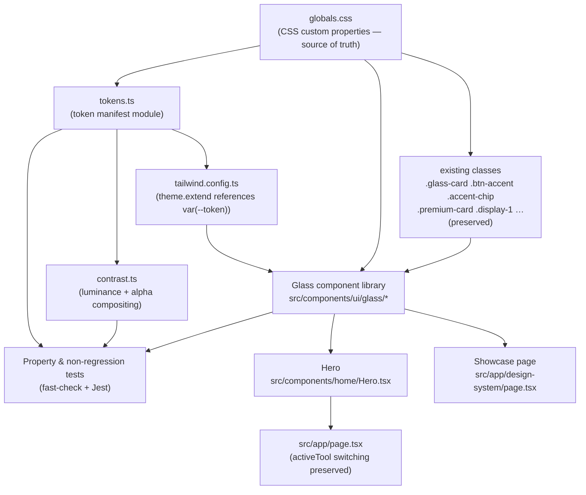
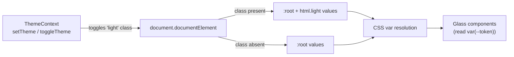
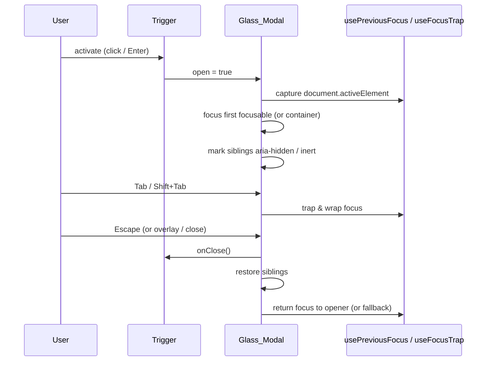
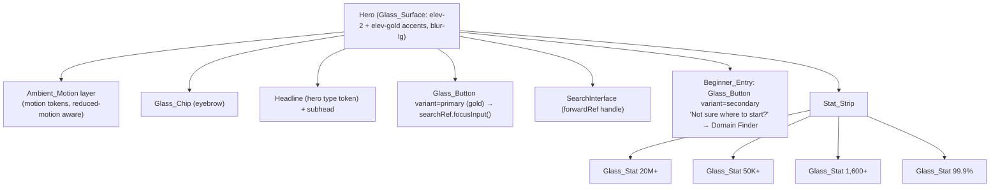

# Design Document

## Overview

This design covers **Phase 0 (Design System & Glass Language)** and **Phase 1 (Home/Hero)** of the DomainDiscovery premium roadmap. It builds directly on the shipped token layer in `src/app/globals.css` — the established CSS-variable source of truth — and extends it without removing or renaming any existing token or component class. Nothing here replaces the existing visual vocabulary; it consolidates, documents, and adds the missing named scales (spacing, blur, motion, typography), then exposes everything through a small, theme-agnostic glass component library and a refined hero.

The central design idea is a single **token manifest module** (`src/design-system/tokens.ts`) that enumerates every design token and, for color tokens, both theme values. Three consumers read from this one source:

1. **`tailwind.config.ts`** maps tokens into the Tailwind theme by referencing the CSS custom properties (never literal values).
2. **Glass components** style their surfaces exclusively from tokens.
3. **Property-based tests** verify parity, mapping equivalence, contrast, and reduced-motion behavior against the same manifest.

Because the manifest, the CSS variables, and the Tailwind mapping all reference the same token *names*, the system stays internally consistent by construction, and the test suite mechanically catches drift (theme parity gaps, unresolved Tailwind references, contrast regressions).

### How Phase 0 / Phase 1 map to the codebase

| Area | Requirement(s) | Where it lands |
| --- | --- | --- |
| New named token scales (spacing, blur, motion, elevation, typography) | 1, 2 | `src/app/globals.css` (`@layer base`) |
| Token reference document | 1.6 | `src/design-system/tokens.ts` (machine-readable) + the Showcase page (human-readable) |
| Tailwind theme mapping | 3 | `tailwind.config.ts` (imports manifest) |
| Glass component library | 4, 7, 8 | `src/components/ui/glass/*` |
| Focus-trap / previous-focus hooks | 8 | `src/components/ui/glass/hooks/*` |
| Contrast utility | 6 | `src/design-system/contrast.ts` |
| Showcase page | 5 | `src/app/design-system/page.tsx` (noindex, not in sitemap) |
| Hero rebuild + Stat strip + Beginner entry | 10, 11, 12, 13 | `src/components/home/Hero.tsx` consumed by `src/app/page.tsx` |
| Non-regression protection | 14 | preserve `globals.css` classes; token-manifest + non-regression tests |

### Open questions resolved (with rationale)

1. **Accent palette.** The gold system (`--accent` = `#E9B44C` dark / `#B8860B` light) is treated as authoritative, per the Phase 0 "keep current palette" directive (Req 7). The roadmap's yellow `#FFD600` / orange `#FF6B00` is recorded as a *possible later rebrand* only. No new accent colors are introduced. If a rebrand is later approved, it changes only the `--accent*` token values in `globals.css`; the manifest, Tailwind mapping, and components need no structural change.
2. **Beginner_Entry destination.** The dedicated Domain Finder is a later phase. The interim destination is a single exported constant `BEGINNER_ENTRY_DESTINATION` (default `'/generator'`, the shipped AI generator, which is the closest "help me start" experience and is already in the sitemap). When the finder ships, only this constant changes. The constant is the single swap point and also the reachability allowlist entry (Req 12.3, 12.4).
3. **Showcase page exposure.** A dev-reachable route at `/design-system`, **excluded from search indexing** via route-segment `metadata.robots = { index: false, follow: false }` and **omitted from `sitemap.ts`**. It is not linked from production navigation. This keeps it available for review without exposing it publicly.

---

## Architecture

### Layered structure

The design is strictly layered so that each layer depends only on the ones beneath it. Tokens never depend on components; components never hard-code values.



### Dependency rules

- **Token layer (`globals.css`)** holds every value. New scales are added in `@layer base` on `:root` (dark) and, for color tokens only, mirrored on `html.light`. Spacing, blur, motion, and typography scales are theme-independent and live on `:root` only (single value, per Req 1.6).
- **Manifest (`tokens.ts`)** is a pure data module: it re-declares token *names* and values as TypeScript constants so tooling can iterate them. It introduces no runtime dependency on the DOM.
- **Tailwind (`tailwind.config.ts`)** imports the manifest and emits `var(--token)` references. It preserves `darkMode: "class"` and the existing `border` mapping.
- **Glass components** read tokens through Tailwind utilities and/or inline `var(--token)` styles. They are theme-agnostic: they never branch on `theme === 'light'`; the CSS cascade resolves the correct value because `html.light` redefines the variables. This is what gives free "component theme parity" (Req 4.4).
- **Hero / Showcase** compose glass components only.

### Theme resolution model



The existing `ThemeContext` is unchanged in behavior: it toggles the `light` class on the document root and persists to `localStorage` with a `dark` default. Because components style from CSS variables, a theme switch needs no component re-render logic — the cascade re-resolves every `var(--token)` automatically, which also makes runtime reduced-motion and theme changes "just work" without reload (Req 9.5, 3.5).

---

## Components and Interfaces

All glass components live in `src/components/ui/glass/` and are re-exported from `src/components/ui/glass/index.ts`. They are client components (`'use client'`) where they manage focus or events. Every component:

- styles surface color/border/shadow from tokens only (Req 4.3),
- accepts `className` (merged via the existing `cn()` helper) and forwards remaining native props,
- applies a token-driven focus-visible ring ≥ 2px for interactive variants (Req 7.1, 7.3).

### Shared elevation handling

A single helper resolves the elevation prop for every component (Req 4.6–4.8):

```ts
// src/components/ui/glass/elevation.ts
export type Elevation = 1 | 2 | 3 | 'gold';
const ELEVATION_VARS: Record<string, string> = {
  '1': 'var(--elev-1)',
  '2': 'var(--elev-2)',
  '3': 'var(--elev-3)',
  gold: 'var(--elev-gold)',
};
export const LOWEST_ELEVATION = 'var(--elev-1)';

/** Total function: any input yields a defined box-shadow value, never throws. */
export function resolveElevation(value?: unknown): string {
  if (value === undefined || value === null) return LOWEST_ELEVATION;     // Req 4.7
  const key = String(value);
  return ELEVATION_VARS[key] ?? LOWEST_ELEVATION;                          // Req 4.6 valid / 4.8 fallback
}
```

This reuses the already-shipped `--elev-1/2/3/gold` tokens as the named elevation scale (Req 1.8, 4.6), so no new elevation values are introduced — the scale is *documented*, not duplicated.

### Glass_Card

A translucent container (Glass_Surface). Built on the semantics of the existing `.glass-card` class, which stays intact for existing consumers (e.g. `DomainSearchBar`).

| Prop | Type | Default | Required | Notes |
| --- | --- | --- | --- | --- |
| `as` | `ElementType` | `'div'` | optional | Polymorphic root element |
| `elevation` | `Elevation` | `1` | optional | Via `resolveElevation` (Req 4.6–4.8) |
| `blur` | `'sm' \| 'md' \| 'lg' \| 'xl'` | `'lg'` | optional | Maps to `--blur-*` (Req 4.5) |
| `padding` | `1\|2\|3\|4\|5\|6\|7\|8` | `5` | optional | Maps to `--space-*` |
| `className` | `string` | `''` | optional | Merged with `cn()` |
| `children` | `ReactNode` | — | optional | |

Renders: `background: var(--glass-bg)`, `backdrop-filter: blur(var(--blur-…))`, `border: 1px solid var(--card-border)`, `box-shadow: resolveElevation(elevation)`, radius from a card-radius token. No literal colors.

### Glass_Nav

A Glass_Surface anchored to the top of the viewport.

| Prop | Type | Default | Required | Notes |
| --- | --- | --- | --- | --- |
| `elevation` | `Elevation` | `2` | optional | |
| `blur` | `'sm' \| 'md' \| 'lg' \| 'xl'` | `'md'` | optional | |
| `sticky` | `boolean` | `true` | optional | `position: sticky; top: 0` |
| `as` | `ElementType` | `'nav'` | optional | Renders with `role="navigation"` when not a `nav` |
| `className` | `string` | `''` | optional | |
| `children` | `ReactNode` | — | optional | |

Renders surface from `--nav-bg` / `--glass-bg` + blur token + elevation. Keyboard order follows DOM order (Req 7.2).

### Glass_Button

The action control. Primary variant resolves the gold presentation from existing accent tokens by composing the shipped `.btn-accent` class (which already draws from `--gradient-gold` / `--accent-contrast` / `--elev-gold`); secondary is a glass surface (Req 4.9, 9-of-4 accent reuse). It renders a native `<button>` so Enter/Space activation and disabled focus-exclusion come for free (Req 7.4, 7.6).

| Prop | Type | Default | Required | Notes |
| --- | --- | --- | --- | --- |
| `variant` | `'primary' \| 'secondary'` | `'secondary'` | optional | `primary` → gold `.btn-accent`; `secondary` → glass |
| `size` | `'sm' \| 'md' \| 'lg'` | `'md'` | optional | Padding from `--space-*` |
| `elevation` | `Elevation` | `1` (secondary) / `'gold'` (primary) | optional | |
| `type` | `'button' \| 'submit'` | `'button'` | optional | |
| `disabled` | `boolean` | `false` | optional | Excluded from tab order; no Enter/Space activation (Req 7.6) |
| `leftIcon` | `ReactNode` | `undefined` | optional | |
| `onClick` | `(e) => void` | `undefined` | optional | |
| `className` | `string` | `''` | optional | |
| `children` | `ReactNode` | — | **required** | Accessible label content |

> Default is `secondary` so that composing a screen never accidentally produces a second gold control; the Hero explicitly opts one button into `primary` (Req 10.3).

### Glass_Chip

Small label/pill built on the existing `.accent-chip` token styling (Req 4.9). Static by default; interactive when `as="button"` / `as="a"`, in which case it exposes a focus ring and Enter/Space activation (Req 7.1, 7.4).

| Prop | Type | Default | Required | Notes |
| --- | --- | --- | --- | --- |
| `as` | `'span' \| 'button' \| 'a'` | `'span'` | optional | Interactive when `button`/`a` |
| `icon` | `ReactNode` | `undefined` | optional | |
| `href` | `string` | `undefined` | optional | Used when `as="a"` |
| `onClick` | `(e) => void` | `undefined` | optional | |
| `className` | `string` | `''` | optional | |
| `children` | `ReactNode` | — | **required** | |

### Glass_Stat

A stat tile (Glass_Surface) showing a value and a label.

| Prop | Type | Default | Required | Notes |
| --- | --- | --- | --- | --- |
| `value` | `string` | — | **required** | e.g. `'20M+'` |
| `label` | `string` | — | **required** | Non-empty descriptor (Req 11.3) |
| `elevation` | `Elevation` | `1` | optional | |
| `blur` | `'sm' \| 'md' \| 'lg' \| 'xl'` | `'md'` | optional | |
| `className` | `string` | `''` | optional | |

Renders glass surface + value (fluid type token) + label (`--text-tertiary`). No literal colors (Req 11.2).

### Glass_Modal

A dialog Glass_Surface with full focus management (Req 8). Rendered into a portal at `document.body`.

| Prop | Type | Default | Required | Notes |
| --- | --- | --- | --- | --- |
| `open` | `boolean` | — | **required** | Controls visibility |
| `onClose` | `() => void` | — | **required** | Called on Escape / overlay / close button |
| `title` | `string` | `undefined` | optional* | Rendered as heading + `aria-labelledby` |
| `ariaLabel` | `string` | `undefined` | optional* | Used when no `title` |
| `initialFocusRef` | `RefObject<HTMLElement>` | `undefined` | optional | First focus target override |
| `closeOnEscape` | `boolean` | `true` | optional | Req 8.3 |
| `closeOnOverlayClick` | `boolean` | `true` | optional | |
| `elevation` | `Elevation` | `3` | optional | |
| `blur` | `'sm' \| 'md' \| 'lg' \| 'xl'` | `'lg'` | optional | |
| `children` | `ReactNode` | — | optional | |

\* Exactly one of `title` / `ariaLabel` must be provided to guarantee a non-empty accessible name (Req 8.5); if both are omitted in development, the component logs a warning and falls back to a generic `aria-label="Dialog"` rather than rendering an empty name.

Behavior:

- **On open** (Req 8.1): focus moves to `initialFocusRef`, else the first focusable descendant, else the dialog container (which is given `tabIndex={-1}`).
- **Focus trap** (Req 8.2): `useFocusTrap` cycles Tab/Shift+Tab within the dialog, wrapping last→first and first→last.
- **Escape** (Req 8.3): closes when `closeOnEscape`.
- **On close** (Req 8.4): `usePreviousFocus` returns focus to the element focused before open; if that element is gone/unfocusable, focus the documented fallback (`document.body` or a supplied fallback).
- **Semantics** (Req 8.5): `role="dialog"`, `aria-modal="true"`, `aria-labelledby` (title id) or `aria-label`.
- **Outside content hidden** (Req 8.6): while open, sibling top-level nodes receive `aria-hidden="true"` (and `inert` where supported); restored on close.



### Hooks

- **`useFocusTrap(containerRef, active)`** — queries focusable descendants, intercepts Tab/Shift+Tab while `active`, wraps focus at the boundaries.
- **`usePreviousFocus(active)`** — on activation captures `document.activeElement`; on deactivation restores it, validating the node is still connected and focusable, else returns a fallback.

### SearchInterface focus exposure (Primary_CTA wiring)

`SearchInterface` already holds an internal `inputRef`. To let the Hero's Primary_CTA place focus on the domain search input (Req 10.5), the component is converted to `forwardRef` exposing an imperative handle:

```ts
export interface SearchInterfaceHandle { focusInput: () => void; }
// inside SearchInterface:
useImperativeHandle(ref, () => ({ focusInput: () => inputRef.current?.focus() }));
```

This is additive — existing call sites that pass no ref are unaffected. The Hero holds `const searchRef = useRef<SearchInterfaceHandle>(null)` and the Primary_CTA `onClick` calls `searchRef.current?.focusInput()`.

### Hero composition



The Hero replaces the inline `showMainSearch` block in `src/app/page.tsx`. The page keeps full control of `activeTool`; only the `activeTool === 'search'` branch renders `<Hero searchQuery={searchQuery} onSearch={handleHeroSearch} onClear={handleHeroClear} />`. All other tool branches, the `HomePageContent` section, and the `/` keyboard shortcut are untouched (Req 14).

**Depth (Req 10.1):** the Hero composes at least two distinct elevation tokens (the hero glass panel at `--elev-2`, the Primary_CTA / accent flourish at `--elev-gold`, stat tiles at `--elev-1`) and at least one blur token (`--blur-lg` on the hero/stat surfaces).

**Refined copy (Req 10.2):** proposed headline and subhead (both within bounds, headline ≠ the forbidden exact phrase):

- Headline (52 chars): `Claim the name your idea deserves.`  ← *primary proposal*
  - Alternate: `Find the name before the world does.` (36 chars)
- Subhead (143 chars): `Search 1,600+ extensions in real time, compare registrar prices side by side, and register in one click. Free, unlimited, and built for speed.`

These are stored as exported constants (`HERO_HEADLINE`, `HERO_SUBHEAD`) validated by `isValidHeroCopy` (see Testing Strategy) so the bounds and forbidden-phrase rule (Req 10.2) are mechanically enforced.

**Single Primary_CTA (Req 10.3):** exactly one `Glass_Button variant="primary"` in the Hero subtree; the Beginner_Entry and pill links use `secondary`/chip styling so no other control carries the gold background.

**Beginner_Entry (Req 12):** a `secondary` Glass_Button (no gold background, Req 12.1) reading `Not sure where to start? → Domain Finder` (Req 12.2). On activation it calls a guarded navigate:

```ts
function goToFinder() {
  if (!isReachable(BEGINNER_ENTRY_DESTINATION)) {   // allowlist check (Req 12.4)
    showToast({ type: 'error', message: 'That path is unavailable right now. Please try again.' });
    return; // Hero state preserved, no navigation (Req 12.4)
  }
  router.push(BEGINNER_ENTRY_DESTINATION);           // Req 12.3
}
```

`isReachable` validates the destination against a known-route allowlist (the same constant set used by the sitemap), using the existing `ToastProvider` for the error indication.

**Responsive (Req 13):** single column at ≤767px (`grid-cols-1`), multi-column desktop at ≥1024px; Stat_Strip is a 4-up row (`lg:grid-cols-4`) on desktop and stacked single column (`grid-cols-1`) at ≤767px. The headline uses the breakpoint-pinned fluid token defined in Data Models so its size is held at the minimum at ≤767px, increases monotonically through the mid range, and is held at the maximum at ≥1024px (Req 13.4). All glass components use `max-width: 100%` / fluid widths so nothing exceeds the viewport from 320–1440px (Req 13.3).

### Showcase page

`src/app/design-system/page.tsx` (App Router). Route-segment metadata sets `robots: { index: false, follow: false }`; the route is **not** added to `sitemap.ts`. It renders:

- all six glass components live (Glass_Card, Glass_Nav, Glass_Modal trigger, Glass_Button, Glass_Chip, Glass_Stat) — Req 5.1;
- one labeled sample per token category: color swatches, the typography scale, the spacing scale, the elevation tiers, and the motion primitives — Req 5.1;
- a user-triggerable example per Motion_Primitive (a "Replay" button re-runs each duration/easing) — Req 5.4, 5.5;
- correct values in both themes (it relies on the same CSS-variable resolution, so toggling the existing theme control re-renders it correctly) — Req 5.2, 5.3;
- under reduced motion, each motion example renders in its final resting state (full opacity, no transform, no animation) — Req 5.6, satisfied by the extended `prefers-reduced-motion` block.

---

## Data Models

### Token manifest (`src/design-system/tokens.ts`)

The manifest is the typed, iterable description of the Token_Layer. It is the data model that the contrast tests, parity tests, mapping tests, and the human-readable Showcase all consume.

```ts
/** A color token defined for both themes. */
export interface ColorTokenDef {
  name: `--${string}`;   // CSS custom property name
  dark: string;          // value resolved on :root
  light: string;         // value resolved on html.light
}

/** A theme-independent token (spacing, blur, motion, typography). */
export interface ScalarTokenDef {
  name: `--${string}`;
  value: string;
}

/** Text-on-surface pairing used by contrast verification. */
export interface ContrastPairing {
  id: string;
  textToken: `--${string}`;       // e.g. --text-primary
  surfaceToken: `--${string}`;    // translucent glass bg, e.g. --glass-bg
  baseToken?: `--${string}`;      // page bg the surface composites over (Req 6.5)
  threshold: 4.5 | 3;             // applicable WCAG ratio (Req 6.1/6.2/6.3)
  largeText?: boolean;
}

/** Tailwind exposure map: utility category → { tailwindKey → cssVarName }. */
export interface TailwindTokenMap {
  colors: Record<string, `var(--${string})`>;
  spacing: Record<string, `var(--${string})`>;
  blur: Record<string, `var(--${string})`>;
  boxShadow: Record<string, `var(--${string})`>;
}

export const colorTokens: ColorTokenDef[];      // every color token, both themes
export const spacingTokens: ScalarTokenDef[];   // --space-1 … (≥6)
export const blurTokens: ScalarTokenDef[];      // --blur-sm/md/lg/xl (≥3)
export const motionTokens: ScalarTokenDef[];    // durations (≥3) + easings (≥2)
export const elevationTokens: ScalarTokenDef[]; // --elev-1/2/3/gold (≥3)
export const typographyTokens: ScalarTokenDef[];// --text-size-* (≥5)
export const contrastPairings: ContrastPairing[];
export const tailwindTokenMap: TailwindTokenMap;
```

### New tokens (names + values)

All new tokens are **added** to `globals.css`; no existing token is removed or renamed (Req 1.2). Scalar scales are theme-independent (single value on `:root`, Req 1.6). The `--elev-*` elevation scale already exists and is *reused* (documented, not re-added).

#### Spacing scale — Req 1.3 (≥6 steps, same unit `rem`)

| Token | Value |
| --- | --- |
| `--space-1` | `0.25rem` |
| `--space-2` | `0.5rem` |
| `--space-3` | `0.75rem` |
| `--space-4` | `1rem` |
| `--space-5` | `1.5rem` |
| `--space-6` | `2rem` |
| `--space-7` | `3rem` |
| `--space-8` | `4rem` |

#### Blur scale — Req 1.4 (≥3 steps)

| Token | Value |
| --- | --- |
| `--blur-sm` | `8px` |
| `--blur-md` | `16px` |
| `--blur-lg` | `24px` |
| `--blur-xl` | `32px` |

(The shipped `.glass-card` keeps its literal `blur(20px)` to avoid any regression; new components use the named scale.)

#### Motion primitives — Req 1.5 (≥3 durations + ≥2 easings)

| Token | Value |
| --- | --- |
| `--motion-duration-fast` | `150ms` |
| `--motion-duration-base` | `300ms` |
| `--motion-duration-slow` | `700ms` |
| `--motion-ease-standard` | `cubic-bezier(0.4, 0, 0.2, 1)` |
| `--motion-ease-entrance` | `cubic-bezier(0.16, 1, 0.3, 1)` (matches existing `rise` easing) |
| `--motion-ease-float` | `ease-in-out` (ambient loop) |

#### Elevation scale — Req 1.8 (≥3 steps, reused)

| Token | Dark value | Light value |
| --- | --- | --- |
| `--elev-1` | `0 1px 2px rgba(0,0,0,0.3)` | `0 1px 2px rgba(15,23,42,0.06)` |
| `--elev-2` | `0 4px 16px -2px rgba(0,0,0,0.45)` | `0 4px 16px -2px rgba(15,23,42,0.1)` |
| `--elev-3` | `0 12px 40px -8px rgba(0,0,0,0.6)` | `0 12px 40px -8px rgba(15,23,42,0.16)` |
| `--elev-gold` | `0 8px 30px -6px rgba(233,180,76,0.28)` | `0 8px 30px -6px rgba(184,134,11,0.22)` |

#### Typography scale — Req 1.9 (≥5 steps)

| Token | Value |
| --- | --- |
| `--text-size-xs` | `0.75rem` |
| `--text-size-sm` | `0.875rem` |
| `--text-size-base` | `1rem` |
| `--text-size-lg` | `1.125rem` |
| `--text-size-xl` | `1.5rem` |
| `--text-size-2xl` | `2rem` |
| `--text-size-hero` | `clamp(2.5rem, calc(2.5rem + (5.25 - 2.5) * (100vw - 767px) / 257), 5.25rem)` |

`--text-size-hero` is breakpoint-pinned so it equals the minimum (`2.5rem`) at ≤767px, rises monotonically across the mid range, and equals the maximum (`5.25rem`) at ≥1024px — exactly what Req 13.4 requires. The existing fluid `.display-1`/`.display-2` classes are untouched.

#### Gold accent (preserved, authoritative — Req 7)

`--accent` = `#E9B44C` (dark) / `#B8860B` (light) and the full `--accent-*` family remain exactly as shipped. The manifest records them as the authoritative accent palette; no component introduces a literal gold.

### Token reference document (Req 1.6)

The reference document is delivered in two synchronized forms:

- **Machine-readable:** `tokens.ts` lists every token with its name; color tokens carry both `dark` and `light` values; scalar tokens carry their single value. This is the authoritative artifact tests assert against.
- **Human-readable:** the Showcase page renders the same manifest as labeled tables/swatches per category, so a reviewer sees every token and both theme values without reading code.

### Elevation type

```ts
export type Elevation = 1 | 2 | 3 | 'gold';
```

Used by every glass component's `elevation` prop and the `resolveElevation` total function.

### Contrast model (`src/design-system/contrast.ts`)

```ts
export interface RGB { r: number; g: number; b: number; }            // 0–255
export interface RGBA extends RGB { a: number; }                     // a 0–1

export function parseColor(input: string): RGBA;                      // #hex, rgb(), rgba()
export function alphaComposite(fg: RGBA, bg: RGB): RGB;               // Req 6.5 — over base bg
export function relativeLuminance(c: RGB): number;                    // WCAG 2.1
export function contrastRatio(fg: RGB, bg: RGB): number;              // rounded to 2 dp (Req 6.6)

/** Effective glass surface = translucent surface composited over the base page bg. */
export function effectiveSurface(surfaceToken: RGBA, baseToken: RGB): RGB;
```

Contrast verification iterates `contrastPairings`, resolves each token's value for both themes from `colorTokens`, computes the effective surface (alpha-composite of the glass background over the theme base background, Req 6.5), rounds the ratio to two decimals (Req 6.6), and compares to the pairing's threshold. Any failure is reported with the failing pairing id, theme, and measured ratio (Req 6.4).

---

## Correctness Properties

*A property is a characteristic or behavior that should hold true across all valid executions of a system — essentially, a formal statement about what the system should do. Properties serve as the bridge between human-readable specifications and machine-verifiable correctness guarantees.*

PBT is appropriate here because the heart of this feature is **deterministic data derived from the Token_Layer** (token names, theme values, the Tailwind map, contrast math, the reduced-motion class set) plus a few **pure functions** (`resolveElevation`, `isValidHeroCopy`, the headline size function, contrast computation). These have large or open input spaces and clear universal invariants. Layout/measurement, modal focus choreography, and "premium feel" judgments are not property-based and are handled in the Testing Strategy via example/integration/manual tests.

The properties below were consolidated from a per-criterion prework analysis to remove redundancy (e.g. every contrast criterion folds into one parameterized contrast property; every "surface uses tokens / flips with theme / no literals" criterion folds into one component parity property; all reduced-motion criteria fold into one completeness property).

### Property 1: Token manifest completeness and theme parity

*For all* color tokens in the manifest, both a dark value and a light value are defined and non-empty, and the set of color-token names defined for the dark Theme is identical to the set defined for the light Theme; *for all* scalar tokens (spacing, blur, motion, elevation, typography), a single non-empty value is defined. Conversely, *for any* manifest in which a color token is present in exactly one Theme, the parity validator reports a violation naming that token.

**Validates: Requirements 1.6, 2.1, 2.6**

### Property 2: Theme toggle round-trip

*For any* starting Theme, applying the Theme toggle twice resolves every color Token to the same value it held before the two toggles.

**Validates: Requirements 2.4**

### Property 3: Theme toggle idempotence

*For any* target Theme and *any* repetition count of one or more, setting the Theme to that target value repeatedly resolves every color Token to the same values as setting it to that target exactly once.

**Validates: Requirements 2.5**

### Property 4: Tailwind mapping equivalence

*For every* Token exposed through the Tailwind theme map, the mapped value is exactly `var(--<name>)` referencing a Token name that exists in the manifest (never a duplicated literal); and *for any* mapped entry whose referenced Token name is absent from the manifest, the mapping-consistency check fails rather than emitting an empty or invalid value.

**Validates: Requirements 3.2, 3.4, 3.6**

### Property 5: Contrast invariant on glass surfaces

*For each* enumerated text-on-surface Token pairing (body text on glass, large text on glass, accent-contrast text on the gold accent background, and focus-ring against its surfaces), in *both* the dark and light Themes, the Contrast_Ratio — computed by alpha-compositing the translucent surface Token over the active Theme's base page background and rounded to two decimal places — meets or exceeds the pairing's applicable WCAG threshold (4.5:1 for body text and accent text, 3:1 for large text and focus indicators). Additionally, *for any* translucent foreground over *any* opaque base, the alpha-composite result is an opaque RGB color with each channel within [0, 255].

**Validates: Requirements 6.1, 6.2, 6.3, 6.5, 6.6, 7.3, 10.6**

### Property 6: Component theme parity and token-only surfaces

*For each* glass component (Glass_Card, Glass_Nav, Glass_Modal, Glass_Button, Glass_Chip, Glass_Stat) rendered with *any* generated set of valid props, the rendered surface colors, borders, and shadows reference only Token_Layer custom properties (no hard-coded color literals); the resolved values switch from dark-Theme to light-Theme values when the `light` class is toggled; Glass_Card, Glass_Nav, Glass_Modal, and Glass_Stat render a translucent background Token together with a blur scale Token; and the gold presentation of Glass_Button (primary) and Glass_Chip resolves from the existing `--accent` Token family.

**Validates: Requirements 4.3, 4.4, 4.5, 4.9, 10.6, 11.2, 11.4**

### Property 7: Reduced-motion completeness

*For every* Motion_Primitive-driven animation class — including the new motion utilities, the Hero Ambient_Motion, and the existing motion utilities (`animate-rise`, `animate-rise-sm`, `animate-scale-in`, `animate-fade-in`, `animate-slide-up`, `animate-float-soft`, `animate-shimmer`) — while Reduced_Motion is active the element resolves to its non-animated final resting state: animation none, full opacity, and no transform offset.

**Validates: Requirements 9.1, 9.2, 9.3, 14.5**

### Property 8: Glass component prop totality and elevation totality

*For each* glass component, rendering with *any* combination of documented prop values within their declared domains produces a valid element without throwing; *for any* input to `resolveElevation` (a valid named tier, `undefined`, or an unrecognized/invalid value) the function returns a defined `var(--elev-*)` value without throwing, defaulting to the lowest tier `var(--elev-1)` when the value is omitted or unrecognized; and *for any* interactive glass component rendered in the disabled state, the element is excluded from keyboard focus traversal and does not activate on Enter or Space.

**Validates: Requirements 4.2, 4.6, 4.7, 4.8, 7.6**

### Property 9: Hero copy validity bounds

*For any* candidate headline string, `isValidHeroCopy` accepts it only when its length is from 1 to 80 characters inclusive and it is not equal to the phrase "Find Your Perfect Domain in Seconds", and accepts a candidate subhead only when its length is from 1 to 160 characters inclusive; the shipped `HERO_HEADLINE` and `HERO_SUBHEAD` constants satisfy these bounds.

**Validates: Requirements 10.2**

### Property 10: Headline fluid sizing is monotonic and breakpoint-pinned

*For any* viewport width, the modeled headline font size equals the minimum scale value at or below 767px, equals the maximum scale value at or above 1024px, and never decreases as the viewport width increases across the intermediate range.

**Validates: Requirements 13.4**

### Property 11: Stat tile label rendering

*For any* non-empty value and non-empty label strings, a Glass_Stat renders exactly one non-empty label element, positioned beneath the value, containing the provided label text.

**Validates: Requirements 11.3**

### Property 12: Non-regression value preservation

*For all* baseline (Token name, Theme) pairs captured before the Design_System changes, the current resolved value equals the frozen baseline value in both the dark and light Themes; and *for any* pair whose current value differs from its baseline, the non-regression check flags the regression identifying the token, the theme, and the differing value.

**Validates: Requirements 14.2, 14.6**

---

## Error Handling

| Condition | Requirement | Handling |
| --- | --- | --- |
| Color token missing in one theme (parity violation) | 2.6 | `validateThemeParity(manifest)` returns the list of offending token names; the parity test fails with those names so the gap is fixed before release. Never resolves to an undefined value. |
| Tailwind utility references an undefined token | 3.6 | `validateTailwindMapping(map, manifest)` detects any `var(--x)` whose `--x` is absent from the manifest and fails the consistency test, surfacing the dangling reference at test/build time rather than rendering empty CSS. |
| Invalid / omitted elevation prop | 4.7, 4.8 | `resolveElevation` is total: unknown or missing values fall back to `var(--elev-1)` without throwing. |
| Modal opened with no focusable child | 8.1 | Focus moves to the dialog container (`tabIndex={-1}`). |
| Modal opener removed before close | 8.4 | `usePreviousFocus` validates the saved node is connected/focusable; if not, focus the documented fallback (supplied fallback ref or `document.body`). |
| Modal given neither `title` nor `ariaLabel` | 8.5 | Dev-time `console.warn`; falls back to `aria-label="Dialog"` so the accessible name is never empty. |
| Beginner_Entry destination unreachable | 12.4 | `isReachable(dest)` (route allowlist) gate; on failure show a toast error via the existing `ToastProvider` and return without `router.push`, preserving Hero state. |
| Contrast pairing below threshold | 6.4 | `verifyContrast` returns failure records `{ pairingId, theme, measuredRatio }`; the contrast test fails listing each. |
| Hero copy out of bounds / equals forbidden phrase | 10.2 | `isValidHeroCopy` returns false; a test asserts the shipped constants are valid, blocking release of bad copy. |
| Token/class resolves differently than baseline | 14.6 | Non-regression test diffs current resolved values against the frozen baseline and fails listing each regression. |
| Reduced-motion preference changes at runtime | 9.5 | CSS-driven animations re-resolve automatically via the `prefers-reduced-motion` media block; any JS-driven motion subscribes to the media query `change` event and applies the static state without reload. |

The design favors **fail-at-test/build-time** for data-integrity errors (parity, mapping, contrast, non-regression) and **graceful degradation** for runtime UI errors (elevation fallback, modal focus fallback, unreachable destination), consistent with the requirements' "flag rather than render invalid" intent.

---

## Testing Strategy

Tooling is already configured: **Jest 30** (jsdom) + **@testing-library/react** + **fast-check 4.5**, with tests under `src/__tests__/` (and co-located `*.property.test.tsx` precedent). New test files:

- `src/__tests__/design-system/tokens.property.test.ts` — Properties 1, 4, 12 (+ parity/mapping/non-regression failure fixtures).
- `src/__tests__/design-system/theme-algebra.property.test.ts` — Properties 2, 3.
- `src/__tests__/design-system/contrast.property.test.ts` — Property 5 (+ contrast utility unit tests).
- `src/__tests__/design-system/glass-components.property.test.tsx` — Properties 6, 8, 11.
- `src/__tests__/design-system/reduced-motion.property.test.ts` — Property 7.
- `src/__tests__/design-system/hero.property.test.ts` — Properties 9, 10.
- `src/__tests__/design-system/glass-modal.test.tsx` — modal behavior examples (Req 8.1–8.6).
- `src/__tests__/design-system/hero.test.tsx` — Hero/Beginner_Entry/Stat_Strip example + interaction tests.
- `src/__tests__/design-system/showcase.test.tsx` — Showcase content examples (Req 5).
- `src/__tests__/design-system/non-regression.test.ts` — existing class presence + baseline snapshot (Req 14.1, 14.4).

### Dual approach

- **Property tests** cover universal invariants over Token_Layer data and pure functions (Properties 1–12). Each runs **≥ 100 iterations** (`{ numRuns: 100 }`, matching the existing suite) and is tagged with a comment referencing its design property.
- **Unit / example tests** cover concrete behaviors not amenable to PBT.
- **Integration / manual** covers browser-dependent layout and the "premium bar" judgment.

### Property test → fast-check mapping and data model

All property tests run over the **token manifest** (`src/design-system/tokens.ts`) and the pure helpers, so they need no real browser for the data-level properties.

| Property | Generator(s) | Assertion |
| --- | --- | --- |
| P1 Manifest completeness & parity | `fc.constantFrom(...colorTokens)`, plus a manifest mutator that drops one theme value | color tokens have non-empty dark+light; dark name set === light name set; mutated manifest flagged |
| P2 Toggle round-trip | `fc.constantFrom('dark','light')` | `resolve(toggle(toggle(t)))` deep-equals `resolve(t)` |
| P3 Toggle idempotence | `fc.constantFrom('dark','light')`, `fc.integer({min:1,max:10})` | applying `setTheme(t)` n times === once |
| P4 Tailwind mapping equivalence | `fc.constantFrom(...Object.entries(tailwindTokenMap...))`, plus dangling-ref fixture | each value === `var(--name)` with name in manifest; dangling ref fails |
| P5 Contrast invariant | `fc.constantFrom(...contrastPairings)` × `fc.constantFrom('dark','light')`; `fc.record` of RGBA/RGB for the compositing sub-property | rounded ratio ≥ threshold; composite opaque & in-range |
| P6 Component theme parity / token-only | `fc.constantFrom(...components)` × generated valid props (`elevation`, `blur`, `padding`, text) | rendered style references `var(--…)`, no literal hex/rgb; dark vs light values differ when class toggled |
| P7 Reduced-motion completeness | `fc.constantFrom(...motionClasses)` | under reduced-motion: animation none, opacity 1, transform none |
| P8 Prop totality / elevation totality / disabled | component × `fc.record(prop domains)`; `resolveElevation` over `fc.anything()`; disabled flag | render never throws; `resolveElevation` always returns valid `var(--elev-*)`; disabled => not tabbable, no Enter/Space activation |
| P9 Hero copy bounds | `fc.string()` for headline/subhead incl. boundary lengths and the forbidden phrase | `isValidHeroCopy` accepts iff within bounds and ≠ forbidden phrase; shipped constants pass |
| P10 Headline fluid sizing | `fc.integer({min:200,max:2000})` viewport widths, plus ordered pairs | ≤767 => min; ≥1024 => max; monotonic non-decreasing |
| P11 Stat label rendering | `fc.string({minLength:1})` value & label (non-whitespace) | exactly one label element containing the text |
| P12 Non-regression | `fc.constantFrom(...baselinePairs)` | current value === frozen baseline value per theme; mismatch fixture flagged |

**Shared data model for tests:** the manifest exports the enumerable token sets, the `contrastPairings` set, the `tailwindTokenMap`, the `motionClasses` list, and a frozen `BASELINE_TOKENS` snapshot. Because the Tailwind config and the tests both import the same manifest, mapping equivalence (P4) is verifiable without parsing CSS, and any future token rename breaks the relevant property test deterministically.

**Contrast utility (`contrast.ts`) tests:** unit tests pin `relativeLuminance` and `contrastRatio` against known WCAG reference pairs (e.g. black/white = 21:1), verify two-decimal rounding (Req 6.6), and property-test `alphaComposite` (opaque, in-range, and α=1 ⇒ identity, α=0 ⇒ base).

### Example / integration / smoke tests (non-PBT criteria)

- **Glass_Modal** (Req 8.1–8.6): testing-library examples — open focuses first focusable / container; Tab & Shift+Tab wrap (representative focusable counts); Escape closes; close returns focus to opener and to fallback when opener removed; `role="dialog"` + non-empty accessible name; siblings `aria-hidden` while open and restored after.
- **Keyboard activation** (Req 7.4, 7.5) and **focus indicator presence** (Req 7.1, 7.2): fire Enter/Space on Glass_Button/Glass_Chip and assert handler parity; assert focus-ring class present and no positive `tabIndex`.
- **Hero** (Req 10.1, 10.3, 10.4, 10.5, 11.1, 12.1–12.5, 13.1–13.5): assert ≥2 distinct `--elev-*` and ≥1 `--blur-*` in the subtree; exactly one primary/gold button; ambient animation references `--motion-*`; CTA activation focuses the search input via the forwarded handle; Stat_Strip has the four required values once each; Beginner_Entry shows the prompt + Domain Finder label, navigates when reachable, and on unreachable shows a toast without navigating; responsive layout-class assertions for mobile/desktop.
- **Showcase** (Req 5): render the route and assert all six components, one labeled sample per token category, a trigger per motion primitive, and reduced-motion final-state rendering.
- **Non-regression** (Req 14.1, 14.4): assert each existing class selector remains in `globals.css` and each baseline class is still available.
- **Build smoke** (Req 14.3): `next build` / `tsc --noEmit` completes with zero new errors (CI gate, single execution).

### Out of automated scope

- Real-viewport overflow at arbitrary widths 320–1440px (Req 13.3) and the cross-device "premium first-impression" bar (Req 10) are verified by manual review against the Linear/Vercel/Family reference set on desktop and mobile, per the requirements note.
